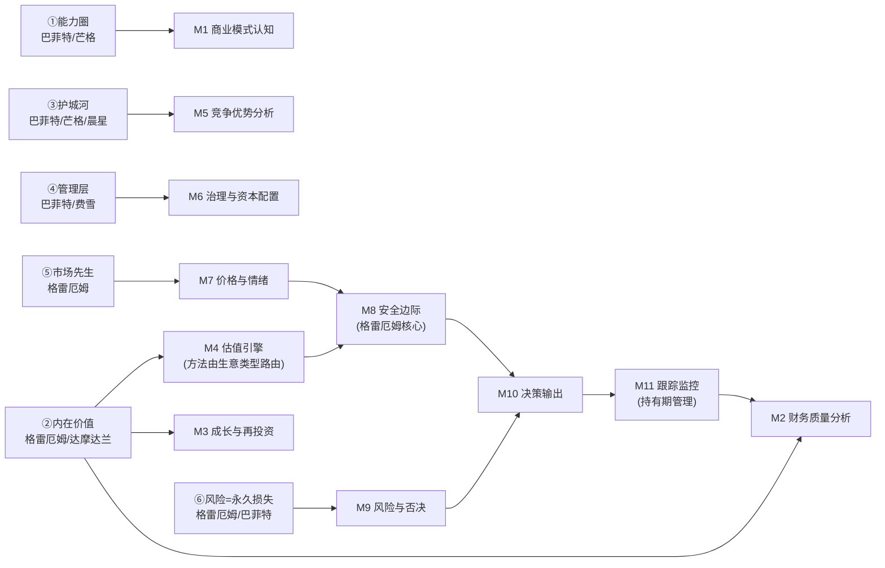
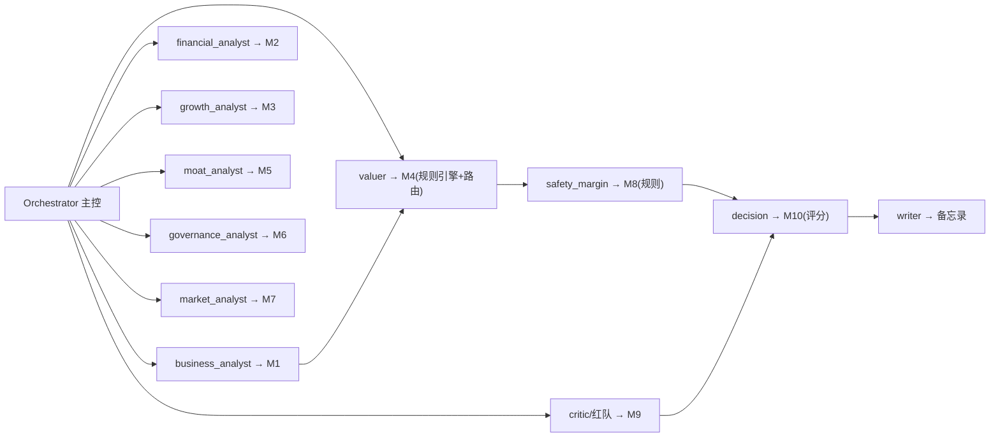

# 价值投资 Agent 开发框架（A 股）

> 定位：输入任意 A 股公司，基于**价值投资理论体系**（格雷厄姆 → 巴菲特/芒格 → 费雪 → 现代估值学派），
> 产出一份可验证的投资备忘录：公司认知、财务质量、成长与景气、护城河、治理、估值、安全边际、风险与决策。

> 设计原则：**先按理论体系拆模块，再谈具体方法**。估值只是内在价值这一个模块的实现，
> 而且用什么估值方法，由"这是什么生意"（商业模式认知模块）决定，而不是预先指定。

---

## 1. 设计原则

| 原则 | 含义 |
|---|---|
| 理论驱动 | 每个模块必须能回溯到某本著作/某位大师的理论支柱，不拍脑袋堆功能 |
| 数据与解释分离 | 数字由确定性引擎产出，LLM 只做解读与定性判断，禁止编造 |
| 多模型交叉 | 任何关键判断（尤其估值）至少两个独立方法交叉验证 |
| 安全边际优先 | 不预测股价，只回答"现价相对内在价值有没有足够折扣" |
| 可回溯可监控 | 每次分析留快照，关键假设与阈值可跟踪、可触发监控 |
| 保守假设 | 增长、折现等参数宁可低估不可高估，且必须显式化 |

---

## 2. 价值投资理论体系 → 模块映射（核心）

价值投资体系可以提炼为 **7 大理论支柱**，每个支柱对应 1–2 个功能模块：



### 模块总览

| # | 理论支柱 | 模块 | 核心问题 | 主要数据 | 输出 |
|---|---|---|---|---|---|
| M1 | 能力圈 | **商业模式认知** | 这是什么生意？我能否理解？ | 年报业务分部、招股书 | 生意类型标签、可理解性评级 |
| M2 | 内在价值（历史） | **财务质量分析** | 历史盈利是真的吗？稳定吗？ | 10 年三大报表 | 财务质量分、造假信号 |
| M3 | 内在价值（未来） | **成长与再投资** | 未来盈利靠什么增长？增长创造价值吗？ | 行业/宏观/资本开支 | 增速假设区间、景气度评级 |
| M4 | 内在价值（估值） | **估值引擎** | 企业值多少钱？ | M2+M3+折现参数 | 内在价值区间 + 敏感性 |
| M5 | 护城河 | **竞争优势分析** | 凭什么比同行赚得多？能持续多久？ | 同行对比、行业格局 | 护城河类型/宽度 + 证据链 |
| M6 | 管理层 | **治理与资本配置** | 管理层诚实吗？钱用对了吗？ | 公告、分红回购、质押减持 | 治理评级、资本配置评分 |
| M7 | 市场先生 | **价格与情绪** | 现在价格贵还是便宜？市场恐惧还是贪婪？ | 估值历史分位、情绪指标 | 价格位置评级 |
| M8 | 安全边际 | **安全边际** | 现价相对价值有多少折扣？ | M4 × M7 | 买卖区间、折扣状态 |
| M9 | 风险 | **风险与否决** | 什么会导致永久损失？ | M2 信号+行业+治理 | 风险清单、一票否决 |
| M10 | 决策 | **决策输出** | 买/不买/买多少？ | 全部模块 | 评分、结论、备忘录 |
| M11 | 持有 | **跟踪监控** | 逻辑还成立吗？何时卖？ | 日频行情、财报季、公告 | 监控事件、卖出建议 |

> 关键设计：**M4 不预设估值方案**。它内部有一个"方法路由"：先看 M1 给出的生意类型，再选择适用的估值方法组合（见 3.4）。

---

## 3. 模块详解

### 3.1 M1 商业模式认知（能力圈）

- **理论**：巴菲特"只投资自己能力圈内的企业"；芒格"能力圈外的机会不是机会"。
- **要回答**：公司靠什么赚钱？卖给谁？成本结构如何？这门生意我能否用一句话讲清楚？
- **产出**：
  1. 商业模式一句话描述 + 业务分部拆解（收入/毛利占比）；
  2. **生意类型标签**（决定估值方法路由）：消费垄断 / 成长 / 周期 / 金融 / 资产型 / 困境反转；
  3. **可理解性评级**：能力圈内 / 边缘 / 圈外（圈外 → 直接降级处理，不强行分析）；
  4. 关键成功要素清单（这个行业做好什么才能赢）。
- **实现**：LLM 解读年报/招股书 + 结构化业务数据；可理解性由人机协同确认（LLM 给初评，用户在 UI 上可改）。

### 3.2 M2 财务质量分析（历史盈利的真实性与稳定性）

- **理论**：格雷厄姆《证券分析》"财务分析的优先目标是防伪"；巴菲特"先看数字，数字背后是故事"。
- **要回答**：报表盈利是真的吗？坏年景能挺住吗？
- **产出**：
  1. 盈利能力：ROE（杜邦拆解：净利率×周转×杠杆）、毛利率/净利率/费用率 8 年趋势；
  2. 盈利真实性：经营现金流/净利润 ≥ 1（连续 5 年）、现金流与利润勾稽；
  3. 稳定性：10 年盈利波动率、最大单年回撤；
  4. 资产质量：应收/存货周转趋势、商誉占比、在建工程异常；
  5. 财务杠杆：资产负债率、有息负债率、流动比率；
  6. **A 股造假/暴雷信号**：审计意见、货币资金与利息收入不匹配、关联交易、质押/减持、问询函（康美、康得新、獐子岛式特征）。
- **输出**：财务质量分（0–100）+ 信号清单；信号命中 ≥N 个 → 进入 M9 一票否决候选。

### 3.3 M3 成长与再投资（未来盈利的来源）

- **理论**：费雪《怎样选择成长股》；芒格"复利是第八大奇迹"；巴菲特"再投资回报率决定长期回报"。
- **要回答**：未来 3–5 年利润靠什么增长？增长是烧钱换来的还是创造价值？
- **产出**：
  1. 行业空间与景气：行业收入增速、渗透率、政策、全球趋势传导（能源转型/AI/人口/国产替代/出海）；
  2. 公司增长引擎：量、价、新业务/新市场三大引擎拆解；
  3. **再投资质量**：ROIC vs WACC、增量资本回报（近 5 年投入资本产生的回报）；
  4. 增长可持续性：增长的确定性评级 + 增速假设区间（保守/中性/乐观）；
  5. 景气度评级：上行 / 平稳 / 下行 + 可监控验证点。
- **实现**：规则引擎（财务） + 行业数据（AkShare 宏观/行业接口）+ LLM 研报新闻 RAG。

### 3.4 M4 估值引擎（内在价值）——方法路由，不预设方案

- **理论**：格雷厄姆"内在价值是由事实决定的价值：资产、盈利、股息、明确前景"；达摩达兰系统估值框架。
- **核心设计：方法路由**——由 M1 的生意类型决定适用方法，不是一套方案套所有公司：

| 生意类型 | 主用估值方法 | 禁用/慎用 |
|---|---|---|
| 消费垄断/稳定增长 | DCF + 股息折现 + 估值分位 | 单看当期 PE |
| 成长型 | DCF 三阶段（保守参数）+ PS/PEG 情景分析 | 用当前盈利线性外推 |
| 周期型 | **PB 估值法（主）+ 正常化盈利 × 封顶 PE + 格雷厄姆数**（2026-08-07 落地；EV/EBITDA/重置成本待补） | 用景气高点盈利做 DCF / 当期盈利 × 历史中位 PE |
| 金融型 | **银行：PB-ROE + DDM；券商：正常化盈利 + PB（等同周期股）；保险：相对PE + DDM**（2026-08-07 落地） | 现金流折现（不适用） |
| 资产型/困境 | NAV / 清算价值 / NCAV（PB/格雷厄姆兜底，NAV 待数据） | 盈利倍数法 |
| 高分红稳定型 | DDM + 相对PE（含公用事业类，唐朝法 PE 封顶 18） | — |

- **输出约定**：
  1. 内在价值 = **[下沿, 上沿]** 区间（v2 起为**加权中位数 ± 加权标准差**，不再取 min~max 包络）；
  2. 关键假设全部显式化（增速、折现率、永续增长 g ≤ 3%）；
  3. 敏感性矩阵（增速 −2pct / WACC +1pct 时价值变化）；
  4. 明确标注"这个公司不适合哪种估值法，为什么"；
  5. 质量影响估值：`0.35×M2 + 0.25×M5 + 0.2×M3 + 0.2×M6` → 质量乘数 0.85~1.1（克制区间）；
  6. kill switch 复用 M2/M3/M5/M6 信号（亏损年/现金流背离/高杠杆/周期下行/护城河缺失），不新造信号；
  7. 输出 `valuation_confidence`（0-1）与 `method_agreement`（跨方法一致性）；
  8. 买卖点由 M8 安全边际模块负责，M4 不重复产出 buy/sell；
  9. **LLM 行业校准层（可选）**：规则估值打底后，LLM 按行业估值惯例校准
     「路由/参数/方法权重/置信度」（全部 clamp 到安全区间），再用校准参数重跑引擎；
     不同行业的估值体系差异由此落地（如银行走 financial 禁 DCF、成长股上调 PEG 权重）；
     未配 LLM 时完全退化为规则结果。
- **实现**：`valuation/` 包内每个方法独立实现、可测试，路由表在 `config/valuation_routing.yaml`
  （方法名 = 已实现函数名，规划中方法不写入，前端只展示可执行方法）。

### 3.5 M5 竞争优势分析（护城河）

- **理论**：巴菲特/芒格护城河；晨星护城河评级框架。
- **要回答**：它凭什么长期比同行赚得多？优势会扩大还是被侵蚀？
- **产出**：
  1. 相对盈利：ROE/毛利率 vs 同行中位数（8 年）；
  2. 护城河来源识别（五类）：无形资产（品牌/专利/牌照）、转换成本、网络效应、成本优势、规模/渠道优势；
  3. 护城河趋势：扩大 / 稳定 / 侵蚀（新进入者、技术变革、监管变化）；
  4. **护城河评级**：宽 / 中 / 窄 / 无 + 证据链（数据 + 定性引用）。
- **实现**：同行对比规则引擎 + LLM 定性（研报、行业新闻）。

### 3.6 M6 治理与资本配置（管理层）

- **理论**：巴菲特"三好标准——诚实、能干、有活力"；股东盈余与资本配置（回购/分红/乱并购）。
- **要回答**：管理层值不值得托付？股东的钱用对地方了吗？
- **产出**：
  1. 股权结构与实控人、管理层激励绑定；
  2. 资本配置记录：分红/回购持续性、大额并购的回报记录、资本开支效率；
  3. 治理风险事件：关联交易、减持、质押、审计变更、监管处罚、问询函；
  4. **治理评级** + 资本配置评分。
- **实现**：公告/股权变动数据规则引擎 + LLM 定性解读。

### 3.7 M7 价格与情绪（市场先生）

- **理论**：格雷厄姆"市场先生是仆人不是主人"——价格可利用，不可指导决策。
- **要回答**：现在的价格处于历史什么位置？市场在恐惧还是贪婪？
- **产出**：
  1. 估值分位：PE/PB/PS/股息率 10 年分位（剔除异常期）；
  2. 股债性价比：股息率/盈利收益率 vs 10 年国债收益率；
  3. 情绪指标：换手率、北向资金、两融余额、新发基金热度、舆论热度（可选）；
  4. **价格位置评级**：极低估 / 低估 / 合理 / 高估 / 泡沫。
- **实现**：行情数据规则引擎；情绪指标可用 LLM 扫描新闻舆情辅助。
- **边界**：M7 只回答"什么价格买"，不回答"买不买"——后者由 M8/M10 决定。

### 3.8 M8 安全边际（格雷厄姆核心）

- **理论**：格雷厄姆"安全边际是价值投资的核心"；"深入分析、本金安全、适当回报"三要素。
- **要回答**：现价相对内在价值有多少折扣？折扣够不够？
- **产出**：
  1. 折扣率 = 1 − 现价 / 内在价值下沿；
  2. **要求折扣率按确定性分级**（与 M5/M9 联动）：护城河宽+确定性高 → 20–25%；一般 → 30–40%；周期/高风险 → ≥50%；
  3. 分批建仓区间（如打 6 折开始第一笔、5 折加仓）；
  4. 卖出参考区间（价值兑现：内在价值上沿附近；或估值分位 > 90%）。
- **实现**：`safety_margin/` 纯规则引擎。

### 3.9 M9 风险与否决（永久损失）

- **理论**：巴菲特"第一条规则：不要亏钱，第二条：不要忘记第一条"；格雷厄姆"风险是损失的可能性，不是波动"。
- **要回答**：什么情况下这笔投资会**永久**亏钱？
- **输入聚合**：M2 造假信号、M3 景气反转、M5 护城河被颠覆、M6 治理风险、高杠杆+周期下行、估值泡沫、单一客户/技术依赖、监管政策风险。
- **产出**：
  1. 风险清单（按发生概率 × 损失幅度排序）；
  2. 最大可承受损失情景（压力测试：景气腰斩 + 估值腰斩）；
  3. **一票否决项**：审计非标、造假信号命中、质押率 > 80%、行业明确消亡趋势 + 高杠杆。
- **实现**：`risk/` 规则引擎 + LLM 红队批判（强制反方论证）。

### 3.10 M10 决策输出（综合判断）

- **理论**：格雷厄姆防御型/进攻型投资人的分类（风险承受与能力匹配）；巴菲特"以合理价格买伟大企业"。
- **要回答**：买 / 不买 / 买多少 / 什么时候买？
- **产出**：
  1. 五维评分卡（各模块归集）：商业模式+护城河（M1+M5）25 / 财务质量（M2）20 / 成长与景气（M3）20 / 估值与安全边际（M4+M7+M8）25 / 治理与风险（M6+M9）10；
  2. 结论档位：强烈关注 ≥80 / 关注 65–79 / 中性 50–64 / 回避 <50；任一否决项 → 回避；
  3. 建议仓位（结合组合集中度约束）；
  4. 完整投资备忘录（模板见第 6 节）。
- **实现**：`decision/` 评分引擎 + `agents/writer` 生成备忘录。

### 3.11 M11 跟踪监控（持有期管理）

- **理论**：巴菲特"最好的持有期是永远，但前提是买入逻辑不变"；格雷厄姆卖出三条件；费雪持续跟踪。
- **要回答**：买入后逻辑还成立吗？何时卖出？
- **产出**：
  1. **持有逻辑关键指标**（分析时锁定）：景气验证点、份额、ROE、现金流、治理事件；
  2. **卖出触发**：达到卖出区间 / 基本面恶化 / 景气评级下调 / 护城河被侵蚀 / 发现确定性更高的替代机会；
  3. 财报季自动复查（每季度重跑 M2/M3）；
  4. 监控事件推送（飞书/企业微信/邮件）。
- **实现**：`monitor/` 定时任务 + 事件驱动。

---

## 4. 模块依赖与数据流

```text
M1(生意类型) ──路由──▶ M4(选估值方法)
M2(财务真实性) ──▶ M3(增长假设) ──▶ M4(估值参数)
M5(护城河) ──▶ M4(增长可持续性) ──▶ M8(要求折扣率)
M6(治理) ──▶ M4(风险调整) ──▶ M9(风险清单)
M7(价格) ──▶ M8(折扣) ──▶ M10(决策)
M9(否决) ──▶ M10(决策)
M10 ──▶ M11(监控) ──循环──▶ M2/M3/M5/M6(复查)
```

**评分卡是 M10 内部的归集层**：每个模块输出一个子评分 + 证据链，加权合成总分。

---

## 5. 指标库（著作 → 工程指标）

| 著作 | 理论要点 | 工程指标 |
|---|---|---|
| 格雷厄姆《聪明的投资者》 | 防御型标准 | PE≤15、PB≤1.5、流动比率≥2、10 年盈利为正≥8 年、连续分红≥10 年、10 年 EPS 增幅≥33% |
| 格雷厄姆《证券分析》 | 内在价值/防伪 | 现金流利润勾稽、资产质量、net-net（NCAV）、审计与财报质量信号 |
| 格雷厄姆公式 | 增长率修正估值 | V = EPS × (8.5 + 2g) × 4.4 / Y（归入 M4 稳定型方法） |
| 巴菲特/芒格 | 好生意好管理 | 10 年 ROE≥15% 且稳定、股东盈余、自由现金流连续为正、低有息负债、资本配置记录 |
| 费雪《怎样选择成长股》 | 15 要点 | 定性清单：产品需求、研发、利润率、销售组织、管理层（归入 M3/M6，LLM 打分） |
| 晨星 | 护城河评级 | 五类护城河来源识别 + 宽度评级（归入 M5） |
| 达摩达兰 | 系统估值 | DCF/FCFF/WACC/终值/敏感性（归入 M4 路由） |

---

## 6. 投资备忘录模板（M10 输出）

```markdown
# {公司} 投资备忘录（{日期}）

## 0 执行摘要      结论/总分/建议仓位/内在价值区间/折扣率
## 1 生意认知      商业模式一句话 + 生意类型 + 能力圈评级（M1）
## 2 财务质量      指标表 + 造假信号 + 财务质量分（M2）
## 3 成长与景气    行业空间、增长引擎、景气评级、增速假设（M3）
## 4 护城河        类型/宽度/趋势 + 证据链（M5）
## 5 治理与资本配置 治理评级 + 资本配置记录（M6）
## 6 估值          多方法对照表 + 敏感性 + 方法适用性说明（M4）
## 7 价格位置      估值分位 + 股债性价比 + 情绪（M7）
## 8 安全边际      折扣率 + 买卖区间（M8）
## 9 风险与反方    风险清单 + 压力测试 + 红队观点（M9）
## 10 监控触发     关键假设/验证点 + 卖出条件（M11）
## 11 数据来源与假设 全部可追溯
## 12 免责声明     不构成投资建议
```

---

## 7. 智能体与工作流（模块即智能体）

> M1–M11 每个模块实现为**独立智能体（Agent）**，注册后即可被任意工作流引用。
> 系统内置默认工作流（M1→…→M11），你也可以新增智能体、用 YAML/代码自由编排分析流。
> **详见 [02-agent-architecture.md](02-agent-architecture.md)。**

### 7.1 LLM Agent 设计（与模块一一对应）



- 每个模块 = 确定性工具 + 可选 LLM 解读；LLM 不产生数字，只做定性判断与解释。
- 幻觉控制：数值必须来自工具返回值；输出做数值一致性校验；关键结论强制引用数据来源；假设显式化。
- 编排：自研轻量 Function-Calling（可测试），LLM 经 LiteLLM 统一接入（DeepSeek/Qwen/GPT/本地）。

---

## 8. 数据层（支撑所有模块）

| 数据 | 来源 | 频率 |
|---|---|---|
| 三大报表/财务指标（10 年） | AkShare（新浪） | 季度 |
| 行情 + 估值历史分位 | AkShare（百度 pe/pb/ps） | 日 |
| 分红送转 | AkShare（巨潮） | 事件 |
| 公告/问询函/减持/质押 | 巨潮 CNINFO、AkShare | 事件 |
| 行业与宏观（PMI/PPI/社融/M2/10Y 国债） | AkShare 宏观接口、统计局 | 月 |
| 研报/新闻（RAG 语料） | 东财/慧博/萝卜投研 | 日/事件 |

- 存储：DuckDB 起步 → PostgreSQL+TimescaleDB；向量库 pgvector/ChromaDB。
- 读取策略（读穿缓存）：存储优先；未入库/库为空时实时源（AkShare）拉取，并**后台回写**存储（首次实时源、之后命中存储，回写失败不影响本次结果）。
- 更新策略：日频行情、财报季触发式、事件驱动；**point-in-time 快照**（回测防前视偏差）。
- 质量校验：pandera schema + 财务勾稽校验，失败数据标记 `quality_flag` 不进分析。

---

## 9. 技术栈与项目结构

**技术栈**：Python 3.11+ · uv · pandas/numpy/scipy · AkShare（免费源）· PostgreSQL(Supabase)/DuckDB · FastAPI · APScheduler · LiteLLM · pytest/pandera · ruff/mypy · Streamlit（MVP UI）。

```text
value-agent/
├── pyproject.toml
├── README.md
├── .env.example
├── config/
│   ├── settings.yaml               # 全局配置
│   ├── indicators.yaml             # 指标定义
│   ├── valuation_routing.yaml      # M4 方法路由表（生意类型→估值方法）
│   └── scoring.yaml                # M10 评分卡权重
├── src/value_agent/
│   ├── main.py                     # FastAPI 入口 / CLI
│   ├── core/                       # 配置、日志、pydantic 模型
│   ├── data/                       # 数据适配器/ETL/校验（支撑全部模块）
│   ├── business_model/             # M1 商业模式认知
│   ├── financials/                 # M2 财务质量（含造假信号）
│   ├── growth/                     # M3 成长与再投资（含景气度）
│   ├── valuation/                  # M4 估值引擎（方法路由）
│   ├── moat/                       # M5 护城河
│   ├── governance/                 # M6 治理与资本配置
│   ├── market/                     # M7 价格与情绪
│   ├── safety_margin/              # M8 安全边际
│   ├── risk/                       # M9 风险与否决
│   ├── decision/                   # M10 评分与决策
│   ├── monitor/                    # M11 跟踪监控
│   ├── agents/                     # LLM 编排（按模块对应 agent）
│   └── backtest/                   # point-in-time 回测（调 M4 路由与 M10 权重）
├── tests/
└── scripts/
```

**CLI 示例**：

```bash
python -m value_agent analyze 600519        # 全模块分析
python -m value_agent analyze 600519 --m M2,M4,M7   # 单模块分析
python -m value_agent monitor --daily       # 每日监控
```

---

## 10. 开发路线图（按模块推进）

| 阶段 | 内容 | 交付物 | 依赖 |
|---|---|---|---|
| S0 数据层 | 免费源（AkShare）适配、ETL、勾稽校验、快照 | 10 只样本股 10 年数据入库 | — |
| S1 硬核三模块 | M2 财务质量 + M4 估值 + M8 安全边际（纯规则，无 LLM） | 可复现的指标表与估值区间 | S0 |
| S2 认知与质量模块 | M1 商业模式 + M5 护城河 + M6 治理（LLM 定性 + 规则） | 三模块评分与证据链 | S1 |
| S3 成长与市场 | M3 成长景气 + M7 价格情绪 | 增速假设 + 价格位置评级 | S2 |
| S4 决策与报告 | M10 评分 + 备忘录 + M9 红队批判 | 第一份完整备忘录 | S3 |
| S5 持有与回测 | M11 监控 + point-in-time 回测 | 监控推送 + 回测报告 | S4 |

> MVP 建议：**S0 + S1**——先把"财务质量 → 估值 → 安全边际"这条格雷厄姆主线跑通（纯规则、无 LLM、结果可人工核验），再叠加认知/护城河/治理等定性模块。

---

## 11. 风险与失败模式

| 风险 | 对策 |
|---|---|
| 数据错报/口径不一致 | 原始财报口径 + 勾稽校验 + quality_flag |
| 回测前视偏差 | point-in-time 快照强制约束 |
| LLM 幻觉 | 数值不出自 LLM + 引用溯源 + 一致性校验 |
| 估值方法用错（如周期股用稳定 DCF） | M4 方法路由 + 每个方法标注适用/禁用场景 |
| 行业景气误判 | 评级必须带可监控验证点，权重封顶 |
| 评分过拟合 | 权重改动须过样本外回测验证 |
| 能力圈误判（分析看不懂的公司） | M1 可理解性评级，圈外降级处理 |

---

## 12. 与旧版框架的差异

- **旧版**：以"数据 → 财务 → 景气 → 估值 → 评分"的数据流水线组织，估值方案（DCF/唐朝法）预先设定。
- **新版**：以**理论支柱 → 模块**组织，估值收敛为 M4 且**方法由生意类型路由决定**；新增了理论必需的 M1 能力圈、M5 护城河、M6 治理、M7 市场先生、M9 风险否决、M11 持有监控等模块。
