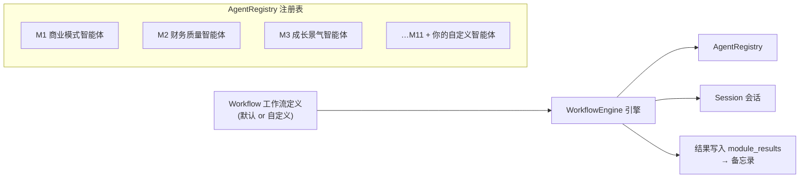
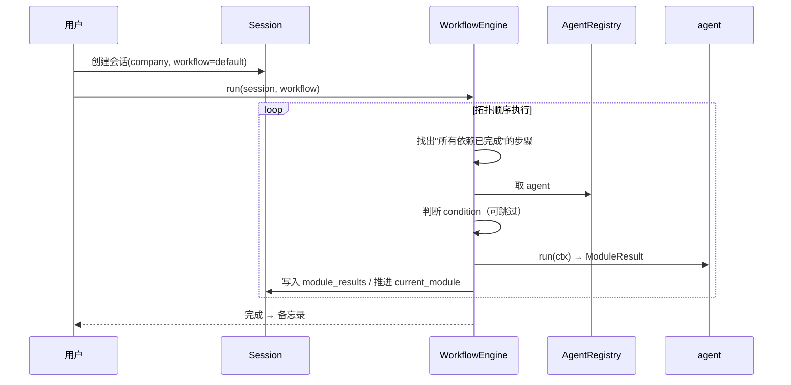

# 智能体与工作流架构

> M1–M11 不再是写死的流水线步骤，而是 **11 个独立、可复用的智能体（Agent）**。
> 系统默认提供一份"标准分析工作流"，把它们串起来；
> 之后你可以**自由新增智能体**，并用**声明式工作流（YAML/Python）自己编排任意分析流**。

---

## 1. 核心概念



| 概念 | 说明 |
|---|---|
| **Agent（智能体）** | 一个独立的分析能力单元，有唯一 id、输入依赖、输出契约（ModuleResult）。M1–M11 是内置的 11 个，你也可以新增自己的 |
| **AgentRegistry（注册表）** | 所有可用智能体的目录，负责注册、发现、校验 |
| **Workflow（工作流）** | 声明式的分析流程定义：哪些智能体、执行顺序、依赖关系、条件、并行 |
| **WorkflowEngine（引擎）** | 按工作流定义执行：拓扑排序、条件判断、失败处理，并把进度写进 Session |
| **默认工作流** | 系统内置 `default`：M1→M2→…→M11 线性链，与理论模块顺序一致 |

---

## 2. Agent 抽象（统一接口）

```python
@dataclass
class AgentSpec:
    id: str                    # "M2_financial_quality"
    name: str                  # "财务质量智能体"
    description: str           # 做什么、什么时候用
    inputs: list[str]          # 依赖的其他 agent id（从会话里取结果）
    requires_llm: bool         # 是否包含 LLM 定性解读
    version: str

class Agent(ABC):
    spec: AgentSpec
    def run(self, ctx: AgentContext) -> ModuleResult: ...
```

- `AgentContext`：会话、`assumptions`、依赖 agent 的结果（`inputs`）、数据访问、LLM client。
- 每个 agent 的产出统一是 `ModuleResult`（模块/状态/评分/结构化输出/证据/LLM 解读），
  因此**任何 agent 的输出都能被其他 agent 消费** —— 这是自由编排的基础。
- 内置 11 个 agent 位于 `src/value_agent/agents/builtin.py`，当前为可跑通全流程的骨架实现，逐个替换为真实逻辑即可。

### 新增一个自定义智能体的方式

```python
from value_agent.agents.base import Agent, AgentContext, AgentSpec
from value_agent.sessions import ModuleResult, ModuleStatus, ModuleName

class ESGRatingAgent(Agent):
    spec = AgentSpec(
        id="M12_esg_rating",
        name="ESG 评级智能体",
        description="基于公开披露评估 ESG 风险（示例自定义智能体）",
        inputs=["M2_financial_quality"],   # 可选依赖
        requires_llm=True,
    )

    def run(self, ctx: AgentContext) -> ModuleResult:
        # 规则/数据 + LLM 定性，产出统一 ModuleResult
        return ModuleResult(
            module=ModuleName("M12_esg_rating"),
            status=ModuleStatus.DONE,
            score=70,
            outputs={"esg_level": "A"},
            evidence=["来源..."],
            llm_explanation="……",
        )

registry.register(ESGRatingAgent())   # 注册即可被工作流使用
```

---

## 3. 默认工作流

```yaml
# config/workflows/default.yaml
id: default
name: 标准价值投资分析
steps:
  - {id: M1, agent: M1_business_model}
  - {id: M2, agent: M2_financial_quality}
  - {id: M3, agent: M3_growth,            deps: [M2]}
  - {id: M4, agent: M4_valuation,         deps: [M1, M2, M3, M5, M6]}
  - {id: M5, agent: M5_moat}
  - {id: M6, agent: M6_governance}
  - {id: M7, agent: M7_market}
  - {id: M8, agent: M8_safety_margin,     deps: [M4, M7]}
  - {id: M9, agent: M9_risk,              deps: [M2, M3, M5, M6]}
  - {id: M10, agent: M10_decision,        deps: [M4, M7, M8, M9]}
  - {id: M11, agent: M11_monitor,         deps: [M10]}
```

- 未写 `deps` 的步骤并行执行（如 M1/M2/M5/M6/M7 可同时跑）。
- 默认工作流在代码里等价定义（`workflow/defaults.py`），YAML 版本用于展示和自定义参考。

---

## 4. 自定义编排（你说了算）

### 4.1 用 YAML 定义自己的分析流

```yaml
# config/workflows/quick.yaml —— 快速版：只跑硬核三件套
id: quick
name: 快速估值流
steps:
  - {id: M2, agent: M2_financial_quality}
  - {id: M4, agent: M4_valuation,        deps: [M2]}
  - {id: M8, agent: M8_safety_margin,    deps: [M4]}
```

```yaml
# config/workflows/cyclical.yaml —— 周期股专用流：跳过不适用的步骤
id: cyclical
name: 周期股分析流
steps:
  - {id: M1, agent: M1_business_model}
  - {id: M2, agent: M2_financial_quality}
  - {id: M3, agent: M3_growth,            deps: [M2]}
  - {id: M4, agent: M4_valuation,         deps: [M1, M2, M3, M5, M6]}
  - {id: M5, agent: M5_moat}
  - {id: M6, agent: M6_governance}
  - {id: M7, agent: M7_market}
  - {id: M8, agent: M8_safety_margin,     deps: [M4, M7]}
  - {id: M9, agent: M9_risk,              deps: [M2, M3, M5, M6]}
  - {id: M10, agent: M10_decision,        deps: [M4, M7, M8, M9],
     condition: "inputs['M1'].outputs.get('type') != 'financial'"}
```

### 4.2 工作流步骤支持的能力

| 能力 | 字段 | 说明 |
|---|---|---|
| 依赖排序 | `deps` | 无依赖的步骤并行执行 |
| 条件跳过 | `condition` | 表达式为假则跳过（如金融股跳过某步骤） |
| 失败继续 | `run_always` | 依赖失败也强制运行（如 M9 红队批判） |
| 参数透传 | `params` | 传给 agent 的步骤参数（如覆盖阈值） |

### 4.3 用代码编排（灵活度最高）

```python
from value_agent.workflow import Workflow, WorkflowStep

flow = Workflow(
    id="my_flow",
    name="我的分析流",
    steps=[
        WorkflowStep(id="M2", agent_id="M2_financial_quality"),
        WorkflowStep(id="M4", agent_id="M4_valuation", deps=["M2"]),
        WorkflowStep(id="M8", agent_id="M8_safety_margin", deps=["M4"]),
        WorkflowStep(id="ESG", agent_id="M12_esg_rating", deps=["M2"]),  # 自定义智能体
    ],
)
engine.run(session, flow, registry)   # 一条命令执行自定义流
```

---

## 5. 执行引擎与会话集成



- 引擎只执行不持状态，进度/结果全部经 Session 持久化；
- **重算/断点续跑**复用会话机制（`sessions/manager.py` 的 `rerun` 依赖链），
  依赖图来自工作流定义，而不是写死的模块表。

### 5.1 失败处理策略

| 策略 | 行为 |
|---|---|
| 默认（fail-fast） | 步骤失败 → 会话 failed，可修复后 resume 续跑 |
| `run_always` 步骤 | 依赖失败仍执行（收集红队/风险信息） |
| 结果 `skipped` | 条件不满足 → 标记 skipped，下游依赖它的步骤按失败处理（除非 run_always） |

### 5.2 执行顺序保证

- 引擎按 `deps` 做拓扑排序；无依赖关系的步骤可并行（V1 串行执行、预留并行接口，V2 可并发）。
- 步骤执行顺序与结果正确性只取决于工作流定义，与注册顺序无关。

---

## 6. 代码结构

```text
src/value_agent/
├── agents/
│   ├── base.py          # AgentSpec / AgentContext / Agent 抽象
│   ├── registry.py      # AgentRegistry 注册表
│   └── builtin.py       # 内置 M1–M11 智能体（骨架实现，可跑通默认流）
├── workflow/
│   ├── models.py        # Workflow / WorkflowStep
│   ├── defaults.py      # 默认工作流（等价于 config/workflows/default.yaml）
│   ├── engine.py        # WorkflowEngine：拓扑执行 + 条件 + 失败处理
│   └── loader.py        # YAML 工作流加载器
└── sessions/            # 会话管理（engine 的进度/结果写入端）
```

---

## 7. CLI 用法

```bash
python -m value_agent analyze 600519                     # 默认工作流
python -m value_agent analyze 600519 --workflow quick    # 自定义工作流
python -m value_agent workflow list                      # 列出可用工作流
python -m value_agent agent list                         # 列出可用智能体
```

---

## 8. 验收标准（S1 补充）

- [ ] 内置 11 个智能体全部注册，`agent list` 可枚举
- [ ] 默认工作流端到端跑通（骨架实现即可），全部步骤完成并写回会话
- [ ] 自定义 YAML 工作流可加载、可执行、按 deps 拓扑排序
- [ ] condition 条件步骤可跳过；run_always 步骤在依赖失败后仍执行
- [ ] 自定义智能体注册后可被工作流引用
- [ ] 重算依赖链来自工作流定义（改 deps 后重算集合随之变化）
