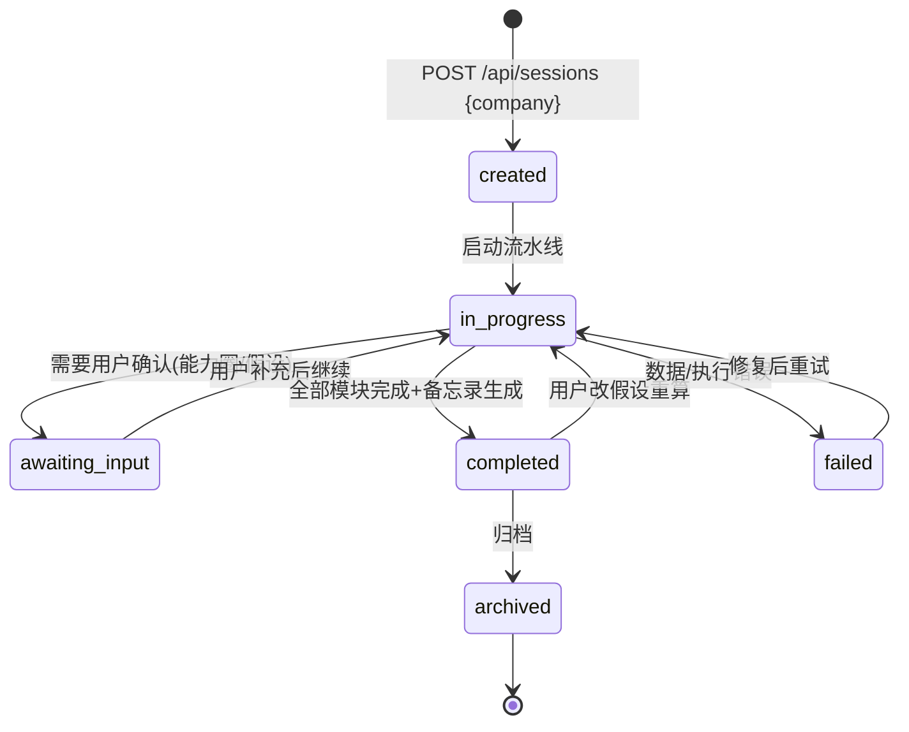
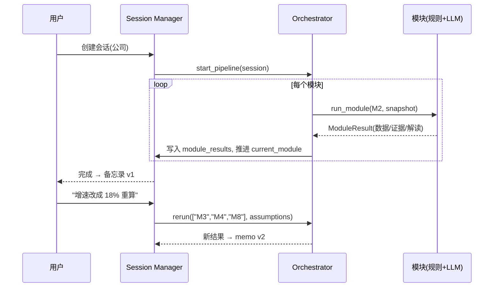

# Agent 会话管理设计

> 一次公司分析不是"请求 → 一次性回答"，而是 **11 个模块、可能多轮交互的长流程**。
> 会话（Session）负责把这个流程变成可暂停、可追问、可重算、可审计的状态化过程。

---

## 1. 为什么需要会话管理

| 场景 | 没有会话管理 | 有会话管理 |
|---|---|---|
| 用户追问"为什么给 15% 增速假设？" | 无法解释，上下文丢失 | 从 module_results 检索当时依据回答 |
| 用户说"改用乐观假设重算估值" | 只能整条流水线重跑 | 沿依赖链只重跑受影响模块，生成备忘录 v2 |
| 分析中途中断/失败 | 全部重来 | 从 current_module 断点续跑 |
| 一周后复查"上次怎么分析的" | 无记录 | 会话绑定数据快照 + 模型版本 + 参数，完全可回溯 |
| 并发分析多只股票 | 状态互相污染 | 每只公司独立会话，天然隔离 |

---

## 2. 会话生命周期（状态机）



合法迁移在 `src/value_agent/sessions/state_machine.py` 中集中定义，非法迁移抛异常（防止状态漂移）。

---

## 3. 数据模型

```python
# src/value_agent/sessions/models.py
SessionStatus = created | in_progress | awaiting_input | completed | failed | archived

class Session:
    id: str
    company_code: str / company_name: str
    status: SessionStatus
    current_module: str | None        # 流水线进度（M1..M11）
    module_results: dict[str, ModuleResult]  # 每个模块的评分/数据/证据/LLM 解读
    assumptions: dict                  # 用户覆盖的假设（增速/折现率/折扣率…）
    data_snapshot_id: str | None       # 绑定数据快照（point-in-time，防前视）
    model_version: str                 # 规则引擎 + LLM 模型版本
    memo_versions: list                # 备忘录版本历史（v1/v2…）
    created_at / updated_at / archived_at
```

```python
class ModuleResult:
    module: str            # "M2_financial_quality"
    status: str            # pending | running | done | failed | skipped
    score: float | None    # 模块子评分（供 M10 加权）
    outputs: dict          # 结构化数据（指标表、估值区间、信号清单…）
    evidence: list[str]    # 证据/引用来源（强制溯源）
    llm_explanation: str | None   # LLM 解读（若有）
    started_at / finished_at
```

```python
class Message:
    id / role(user|assistant|system) / content / created_at
    action: str | None     # 如 "rerun_M3"、"update_assumption"
```

---

## 4. 核心能力

### 4.1 多轮追问
- `completed` 后可继续发消息；系统从 `module_results` 中检索对应模块的输出作为上下文回答。
- 追问不改数据，只加对话记录。

### 4.2 假设重算（依赖链最小重跑）
用户在 `assumptions` 上做局部修改，沿依赖链只重跑受影响模块：

```text
改 M3 增速 → 重跑 M4(依赖M3) → M8(依赖M4) → M10 → 备忘录 v2
改 M7 价格窗口 → 重跑 M8 → M10
改 M1 生意类型 → 重跑 M4(方法路由) → M8 → M10
```

依赖表（`MODULE_DEPENDENCIES`）：

| 模块 | 直接依赖 |
|---|---|
| M3 成长 | M2 |
| M4 估值 | M1, M2, M3, M5, M6 |
| M8 安全边际 | M4, M7 |
| M10 决策 | M4, M7, M8, M9 |

重算**默认复用同一数据快照**（保证前后一致），用户明确要求"更新数据"时才重新打快照。

### 4.3 断点续跑
- `in_progress` 中断（进程重启/网络失败）→ 从 `current_module` 恢复；
- 失败模块标记 `failed`，修复后仅重跑失败模块及下游。

### 4.4 审计与回溯
- 每个会话绑定：`data_snapshot_id` + `model_version` + `assumptions` + 各模块 `evidence`；
- 备忘录每版可回放：当时用了什么数据、什么假设、什么版本。

---

## 5. 存储设计

| 表 | 字段要点 |
|---|---|
| sessions | id, company_code, status, current_module, assumptions(JSON), data_snapshot_id, model_version, memo_versions(JSON), 时间戳 |
| session_messages | id, session_id, role, content, action, created_at |
| session_module_results | session_id, module, status, score, outputs(JSON), evidence(JSON), llm_explanation, 时间戳 |

- 起步：SQLite/DuckDB（单机，简单可靠）；生产：PostgreSQL。
- 迁移工具：起步用轻量脚本建表，生产引入 Alembic。

---

## 6. API 设计

```text
POST   /api/sessions                        # 创建会话并启动分析
  body: {company: "600519"}
GET    /api/sessions/{id}                   # 会话状态 + 各模块进度
POST   /api/sessions/{id}/messages          # 追问或指令
  body: {text: "...", action?: "rerun_M3"}
POST   /api/sessions/{id}/rerun             # 重跑指定模块（含依赖）
  body: {modules: ["M3"], assumptions: {"growth_rate": 0.18}}
GET    /api/sessions/{id}/memo              # 获取备忘录（有版本取最新，否则现算）
POST   /api/sessions/{id}/memo              # 生成并保存备忘录版本（版本化 +1）
POST   /api/sessions/{id}/resume            # 恢复 failed/awaiting_input（断点续跑）
DELETE /api/sessions/{id}                   # 删除会话
GET    /api/sessions?status=completed       # 会话列表
POST   /api/sessions/{id}/archive           # 归档
```

---

## 7. 与流水线和 LLM Agent 的关系



- **Orchestrator 只负责执行，不持有状态**；一切状态读写在 Session Manager。
- 每个模块的 LLM 解读结果存 `module_results[key].llm_explanation`，重算时只更新受影响项。

---

## 8. 代码骨架（已就位）

```text
src/value_agent/sessions/
├── __init__.py
├── models.py          # Session / ModuleResult / Message / SessionStatus / ModuleName
├── state_machine.py   # 状态迁移表 + transition()
├── store.py           # 存储接口（save/load/list），DuckDB 实现占位
└── manager.py         # 会话管理器：create/start/rerun/resume/complete/archive
```

---

## 9. 验收标准（S1 里程碑）

- [ ] 状态机全部合法迁移有测试覆盖，非法迁移抛异常
- [ ] 创建会话 → 流水线推进 → 完成 → 归档，全流程可跑通（可先接假的 pipeline）
- [ ] 改假设触发依赖链最小重跑（用日志断言只跑了受影响模块）
- [ ] 中断后可从 current_module 恢复
- [ ] 每个会话能回溯 data_snapshot_id + model_version + assumptions
