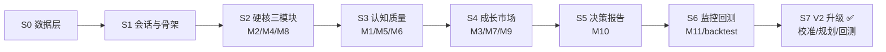
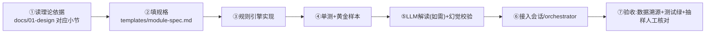

# 开发引导

> 本文档把开发过程拆成 **里程碑 → 任务 → 验收标准**，并规定"与 AI 协作开发"的会话工作流。
> 每完成一个里程碑：更新 [progress.md](progress.md) → 提交一次代码。

---

## 1. 开发会话工作流（与 AI 协作）

### 1.1 会话划分原则

| 原则 | 说明 |
|---|---|
| **一个里程碑一个会话** | 避免单个会话过长导致上下文丢失、状态混乱 |
| **开工前先写目标** | 每个会话开头按模板声明目标/范围/验收标准 |
| **结束前产出小结** | 要求 AI 输出：改动文件列表、验证命令与结果、未完成事项 |
| **进度落盘** | 关键进展写入 `docs/progress.md`，不留在对话里 |
| **关键决策进文档** | 架构性改动先改 `docs/` 再写代码 |

### 1.2 会话开始模板（复制到每个开发会话第一句）

```text
目标：<完成 S? 里程碑：…>
范围：<涉及哪些模块/文件，明确不做哪些>
验收标准：<可执行验证：pytest / CLI 命令 / 输出样例>
相关文档：docs/01-design.md §3.4、docs/05-coding-conventions.md
```

### 1.3 会话结束模板（要求 AI 在最后输出）

```text
改动文件：<列表>
验证结果：<跑过的命令与输出>
未完成/风险：<列表>
```

### 1.4 提交规范

```text
feat: M2 财务质量引擎（ROE 杜邦拆解 + 造假信号）
test: M2 黄金样本指标校验
docs: 更新 progress.md（S2 完成）
```

每次提交只做一件事；一个里程碑一个提交（或按逻辑拆 2-3 个）。

---

## 2. 里程碑路线图



### S7 V2 升级（已落地 2026-08-08）

> 目标：LLM 评分从「绝对分替换」升级为「规则分锚 + 有界校准」，并引入画像 Planner、函数注册表与回测闭环。
> 设计与验收见 [12-v2-upgrade.md](12-v2-upgrade.md)。

| 阶段 | 内容 | 落地 |
|---|---|---|
| P1 | 评分校准 v2：delta 制 + 证据校验 + 动态上限 + 档位保护 | ✅ |
| P2 | 校准策略配置化（`config/llm_calibration.yaml`）+ trace 落库 | ✅ |
| P3 | 校准 A/B 回放（`scripts/calibration_ab.py`）+ 模块 PIT 回测（`scripts/backtest_module.py`） | ✅ |
| P4 | 画像 Planner（`src/value_agent/planner/`）+ M1→M4 接线 + plan 稳定性 | ✅ |
| P5 | 接线（completeness→校准上限）+ 函数注册表（`src/value_agent/tools/`） | ✅ |

**维护提示**：校准策略改 `config/llm_calibration.yaml`（不用改代码）；LLM 校准开/关、cap 大小由校准 A/B 数据驱动。

### S0 数据层（≈2–3 周）

**目标**：10 只样本股（茅台/宁德/美的/招行/紫金/比亚迪/海康/伊利/隆基/恒瑞，覆盖消费/新能源/制造/金融/周期）10 年财报 + 行情入库，可复现。

| 任务 | 产物 | 验收 |
|---|---|---|
| 免费源适配器（AkShare） | `data/sources/` | 统一接口，切换数据源不改业务代码 |
| 表结构 | `data/models/` | 见 01-design §8 |
| ETL + 增量更新 | `data/pipelines/` | 财报季触发、日频行情 |
| 勾稽校验 | `data/pipelines/validate.py` | 净利润勾稽、现金流勾稽、异常标记 quality_flag |
| 数据快照 | `data/snapshots/` | point-in-time 快照可用（回测依赖） |

**验收命令**：`python -m value_agent data init --samples` 成功；校验报告无未标记异常。

### S1 会话与骨架（≈1–2 周）

**目标**：智能体注册表 + 工作流引擎 + 会话管理全流程跑通（可用假数据/fake pipeline），
后续所有模块都以"智能体"形式挂进工作流。

| 任务 | 产物 | 验收 |
|---|---|---|
| Agent 抽象 + 注册表 | `agents/base.py` `registry.py` | agent list 可枚举；自定义智能体可注册 |
| 内置 M1–M11 智能体 | `agents/builtin.py` | 骨架实现可跑通默认工作流 |
| 工作流模型 + 默认流 | `workflow/models.py` `defaults.py` | 拓扑排序正确（见 02 §8） |
| 工作流引擎 | `workflow/engine.py` | 条件跳过 / run_always / 失败处理 |
| YAML 自定义工作流 | `workflow/loader.py` `config/workflows/` | quick.yaml 可加载可执行 |
| 数据模型/状态机 | `sessions/models.py` `state_machine.py` | 迁移表 + 非法迁移抛异常（见 03 §9） |
| 存储 | `sessions/store.py` | 会话/消息/模块结果持久化 |
| 管理器 | `sessions/manager.py` | create/rerun(依赖链)/resume/archive |
| CLI/API 骨架 | `main.py` | 创建会话 → 指定工作流 → 完成 → 备忘录占位 |

**验收**：02 §8 + 03 §9 全勾。

### S2 硬核三模块：M2 财务质量 + M4 估值 + M8 安全边际（≈2–3 周）

**目标**：纯规则、无 LLM，结果可人工核验——先把格雷厄姆主线跑通。

| 模块 | 任务要点 | 验收 |
|---|---|---|
| M2 | ROE 杜邦拆解、现金流勾稽、造假信号清单 | 对样本股输出指标表 + 信号，与年报抽查一致 |
| M4 | 各估值方法独立实现 + 方法路由 + 敏感性 | 估值区间输出，周期股/金融股路由正确 |
| M8 | 折扣率、要求折扣分级、买卖区间 | 区间与人工估算误差在约定范围 |

**验收**：`python -m value_agent analyze 600519 --m M2,M4,M8` 输出完整；`pytest` 绿。

### S3 认知质量：M1 商业模式 + M5 护城河 + M6 治理（≈2–3 周）

**目标**：引入 LLM 定性分析（能力圈/护城河/管理层），建立证据链与幻觉校验。

| 模块 | 任务要点 | 验收 |
|---|---|---|
| M1 | 业务分部拆解、生意类型标签、可理解性评级 | 标签与人工判断一致率 ≥ 80%（10 只样本） |
| M5 | 同行对比 + 五类护城河识别 + 宽度评级 | 评级附证据链（数据+引用） |
| M6 | 股权/激励/分红回购/质押减持 + 治理评级 | 事件清单可溯源公告 |

### S4 成长市场：M3 成长景气 + M7 价格情绪 + M9 风险否决（≈2–3 周）

| 模块 | 任务要点 | 验收 |
|---|---|---|
| M3 | 行业空间/景气评级/增速假设区间/ROIC vs WACC | 景气评级带可监控验证点 |
| M7 | 估值分位/股债性价比/情绪指标 | 分位口径与乐咕乐股一致 |
| M9 | 风险清单 + 一票否决 + 红队批判 | 否决项触发 → 结论强制"回避" |

### S5 决策报告：M10 评分 + 投资备忘录（≈1–2 周）

**目标**：全模块集成，产出第一份完整备忘录。

| 任务 | 验收 |
|---|---|
| 评分卡引擎（权重可配置） | 权重改动经样本外回测验证 |
| 备忘录生成（markdown/PDF） | 模板全字段，数字与数据源一致 |
| 会话重算 → 备忘录 v2 | 改假设后只重跑受影响模块 |

### S6 监控回测：M11 + backtest（≈2–3 周）

| 任务 | 验收 |
|---|---|
| 监控规则 + 推送（飞书/企业微信） | 触发条件可配置，事件可推送 |
| point-in-time 回测 | 无前视偏差，回测报告可复现 |

---

## 3. 模块开发流程（新增/完善任一模块）



1. **读理论**：先在 `01-design.md` 找到该模块的理论支柱与产出约定。
2. **填规格**：复制 `docs/templates/module-spec.md`，写清楚输入/输出/公式/阈值/证据要求。
3. **规则先行**：先实现确定性计算（不要先写 LLM）。
4. **黄金样本**：用样本股真实数据做测试用例，锁定输出，防回归。
5. **LLM 解读**：只做定性解释，遵守 04 §4 幻觉控制清单。
6. **接入会话**：模块结果写入 `session.module_results`，支持重算依赖。
7. **验收**：数据可溯源、测试绿、抽样人工核对一份输出。

---

## 4. 验证与质量门禁

| 门禁 | 命令/要求 |
|---|---|
| 单测 | `pytest`（每模块至少覆盖黄金样本 + 边界 + 异常） |
| 静态检查 | `ruff check`、`mypy src` |
| 数据校验 | 勾稽校验测试、schema 测试（pandera） |
| LLM 校验 | 数值一致性测试（输出数字必须与数据源一致） |
| 人工抽查 | 每个里程碑抽 1 份备忘录/指标表人工核对 |

> 门禁不通过不提交。AI 开发会话结束时必须给出跑过的验证命令与结果。

---

## 5. 常用命令

```bash
uv sync                                   # 安装依赖
python -m value_agent data init --samples # S0：初始化样本数据
python -m value_agent analyze 600519      # 全模块分析
python -m value_agent analyze 600519 --m M2,M4,M8   # 指定模块
python -m value_agent monitor --daily     # 每日监控
python -m value_agent backtest --pool hs300           # 回测
pytest -q                                 # 测试
```

---

## 6. 下一步（当前状态）

当前处于 **S0 前**：框架设计完成，代码骨架已建（含 sessions）。下一步：

```text
1. 读 docs/01-design.md（如未读）
2. 开始 S0：让 AI 搭建数据层（akshare 适配器 + 表结构 + ETL）
3. 每完成一个任务更新 docs/progress.md 并提交
```
