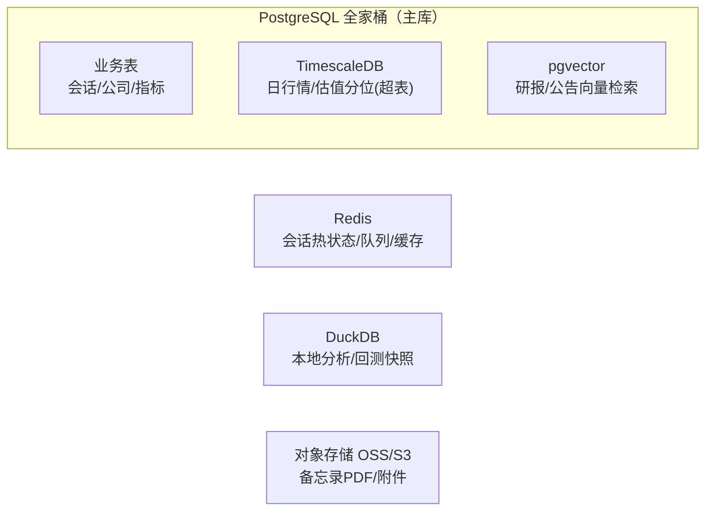

# 技术选型与部署

> 一句话结论：**后端 Python(FastAPI) + PostgreSQL(Supabase) + Next.js 前端，部署选 Render + Supabase + Vercel 免费组合**。
> 数据源全部用**免费源（AkShare）**，零积分零 token；该组合适合个人自用/演示/海外用户。

---

## 1. 选型总览

| 层 | MVP（最快出活） | 生产（A 股实战） | 理由 |
|---|---|---|---|
| 前端 | Streamlit | Next.js + Tailwind + ECharts + Ant Design | 见 §2 |
| 后端 | FastAPI（复用现有代码） | FastAPI + APScheduler + ARQ/Celery | 与 sessions/workflow 同语言，直接复用 |
| 数据库 | DuckDB + SQLite | PostgreSQL + TimescaleDB + pgvector + Redis | 见 §4 |
| LLM | DeepSeek API | DeepSeek/Qwen + LiteLLM（可切本地） | 便宜、中文好、可降级 |
| 部署 | **Render Free + Supabase Free + Vercel Free（选定，全免费）** | —（不采用付费项） | 见 §5、[07](07-deployment-guide.md) |

---

## 2. 前端

### MVP：Streamlit
- 10 分钟出仪表盘：会话列表、进度条、指标表、估值区间、备忘录渲染。
- 零前端代码，直接调 FastAPI。适合内部自用/验证。

### 生产：Next.js（推荐）或 Vue3
| 项 | 推荐 | 说明 |
|---|---|---|
| 框架 | Next.js 15（App Router）+ TypeScript | SSR 支持备忘录分享/SEO |
| UI | Ant Design | 中文生态、表格/表单成熟 |
| 图表 | ECharts | A 股用户习惯 K 线、PE band、估值分位图 |
| 样式 | Tailwind CSS | 快速布局 |
| 渲染策略 | 备忘录页 SSR（可分享、可打印）；分析仪表盘 CSR + SSE 实时进度 | 混合渲染 |

- 备选：Vue3 + Element Plus + ECharts（同样成熟，团队熟 Vue 就用）。
- 可选扩展：飞书/企业微信机器人推送监控结果（国内用户最方便）。

---

## 3. 后端

| 模块 | 选型 | 说明 |
|---|---|---|
| API | FastAPI + Pydantic v2 | 异步、类型安全，与现有 `sessions/` `workflow/` 直接集成 |
| 任务队列 | MVP：FastAPI BackgroundTasks；生产：ARQ（Redis）或 Celery | 一次分析 = 11 个 agent，可能 1–2 分钟，必须异步 |
| 实时进度 | SSE / WebSocket | 把 `session.current_module` 推给前端 |
| 定时任务 | APScheduler | 每日行情更新、监控触发 |
| LLM 网关 | LiteLLM | 统一 DeepSeek/Qwen/OpenAI/本地 Ollama，可切换 |
| 文档生成 | reportlab / markdown → PDF | 备忘录导出 |

> **不要**为了前端上 Node 再写一套后端 —— 分析引擎是 Python，保持单语言最省事。

---

## 4. 数据库



| 数据 | 选型 | 理由 |
|---|---|---|
| 会话、公司、财务指标 | PostgreSQL 16 | 关系型、事务、成熟 |
| 日行情、估值历史（10 年×5000 股 ≈ 千万行） | TimescaleDB（PG 扩展） | 超表压缩、时间范围查询快 |
| 研报/新闻向量（RAG） | pgvector（PG 扩展） | 一个库搞定，不引 Milvus；量大了再换 |
| 缓存、任务队列 | Redis 7 | 会话热状态、ARQ 队列、限流 |
| **Supabase（选定，免费）** | 托管 PostgreSQL + pgvector（新加坡区） | 500MB、7 天暂停、无 TimescaleDB（行情用普通表+索引） |
| 回测/本地分析 | DuckDB + Parquet | point-in-time 快照文件化，回测隔离 |
| 备忘录 PDF/附件 | 阿里云 OSS / MinIO | 对象存储便宜 |

> 起步可以只用 DuckDB + SQLite 单机跑通，生产再迁 PG 全家桶（表结构已按可迁移设计）。

---

## 5. 部署：选定 Render + Supabase + Vercel（免费组合）

> **最终选择**：Render（后端）+ Supabase（数据库）+ Vercel（前端），全免费、无国内采集。
> 数据源全部免费：**AkShare（新浪/东财/百度）**，零积分零 token。
> 📖 操作手册见 **[07-deployment-guide.md](07-deployment-guide.md)**。

### 5.1 为什么这么选

| 取舍 | 说明 |
|---|---|
| 成本 | $0/月（Render 750h + Supabase 500MB + Vercel Hobby） |
| 省心 | 不用自建服务器、不用国内采集链路，GitHub 全自动部署 |
| 代价 1 | Render 免费 Web Service **15 分钟休眠** + 冷启动 30–60s（个人低频可接受） |
| 代价 2 | Supabase **7 天不活跃暂停**（GitHub Actions 每日写入即保活） |
| 代价 3 | 海外节点 → 国内访问有延迟波动；适合个人自用/演示/海外用户 |
| 代价 4 | Supabase 无 TimescaleDB、仅 500MB → 自选股 ≤100 只 |

### 5.2 免费额度速查（2026）

| 服务 | 额度 | 备注 |
|---|---|---|
| Render Web Service | 512MB RAM / 0.1 CPU / 750 小时·月 | 15 分钟休眠、冷启动 30–60s |
| Render Cron | 免费 | 每日数据更新 + 监控 |
| Supabase | 500MB DB / pgvector ✅ / TimescaleDB ❌ | 7 天暂停、数据不删 |
| Vercel | Hobby 免费 | 函数时长有限 → 长连接直连 Render |

### 5.3 备选方案（需要时再换）

| 场景 | 免费方案 |
|---|---|
| 数据量超 500MB | 控制自选股数量（≤100）、清理 10 年外历史数据；仍不够用 DuckDB 本地分析 |
| 需要国内访问 | 免费边界为个人自用/演示；必要时本地运行分析（AkShare 本地 100% 可用） |

## 6. 部署文件（已建模板）

```text
deploy/
├── render.yaml        # Render 蓝图：web + cron（本方案主用）
├── vercel.json        # 前端 rewrites
└── Dockerfile         # FastAPI 镜像（含免费数据源 akshare）
```

---

## 7. 决策清单（按当前阶段）

| 阶段 | 动作 |
|---|---|
| 现在（开发期） | 本机跑：DuckDB/SQLite + FastAPI + Streamlit，零部署成本 |
| S5 前后（要给人看） | **Render + Supabase + Vercel 免费组合**（见 07） |
| 数据量增长 | 控制自选股/清理历史（免费）；必要时本地 DuckDB 分析 |
