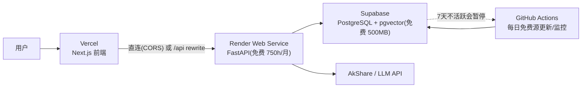

# 部署指南：Render（后端）+ Supabase（数据库）+ Vercel（前端）

> **选定方案**：全免费组合，去掉国内每日采集。
> 数据层全部用**免费源（AkShare）**，零积分、零 token。
> 选型理由见 [06-tech-stack.md](06-tech-stack.md)。

---

## 0. 目标架构



**模式说明**：全部服务走海外（Render 美东 / Supabase 新加坡 / Vercel 全球边缘），
无国内节点 —— 面向国内用户访问会有延迟波动，适合个人自用/演示/海外用户。

---

## 0.1 免费额度边界（2026 已核实）

| 服务 | 免费额度 | 对本项目 |
|---|---|---|
| Render Web Service | 512MB RAM / 0.1 CPU / 750 小时·月；**15 分钟无流量休眠**，冷启动 30–60s | API 个人低频够用；0.1 CPU 跑全量分析偏慢 |
| GitHub Actions | 私有仓库 **2000 分钟/月**（公共无限）；无需绑卡 | 每日采集/监控每次 3–10 分钟，绰绰有余（**替代 Render Cron：cron 最低 $1/月**） |
| Render 静态站 | 100GB 带宽/月 | 前端可托管（本方案用 Vercel） |
| Supabase | **500MB DB** / 1GB 存储 / 2 项目；**7 天不活跃自动暂停**；pgvector ✅ / TimescaleDB ❌ | 自选股 ≤100 只可容纳；每日写入即保活 |
| Vercel | Hobby 免费；函数时长有限 | 只做页面 + rewrites，长连接走直连 |

> ⚠️ 三个免费层政策都可能调整；免费 Postgres 过期问题已规避（Supabase 数据不删，只暂停）。

---

## 0.2 数据采集策略（无国内采集）

| 数据源 | 部署环境用法 | 说明 |
|---|---|---|
| **AkShare（主·免费）** | Render 上直接调用，需 `data ping` 实测 | 全免费、覆盖最全：新浪财报（含行业）、东财前复权日线、百度 **10 年估值分位（pe/pb/ps）**、巨潮分红；海外 IP 有被限流风险 |
| LLM | DeepSeek / Qwen API | 无地域限制 |
| LLM | DeepSeek / Qwen API | 无地域限制 |

> 💰 **免费方案**：`config/settings.yaml` 已设 `primary: akshare`，回退链 `akshare → mock`；财报/日线/估值/分红全部由 AkShare 提供。
> **部署后先跑 `python -m value_agent data ping`**，实测各源连通性。

**按需 + 缓存**：用户分析某公司时才拉取（未缓存则实时取数），命中缓存直接分析；
**每日 GitHub Actions**（`.github/workflows/daily.yml`，替代 Render Cron）：只更新自选股池（≤100 只）的行情与财报，控制 Supabase 容量与数据源请求量；Render Cron 最低 $1/月，故用免费的 Actions。

---

## 1. Render 部署后端

### 1.1 准备

| 项 | 操作 |
|---|---|
| 账号 | Render 用 GitHub 登录，免费 Hobby 计划 |
| CLI | `npm i -g render-cli`，`render login`（或纯 GitHub 集成） |
| 代码仓库 | GitHub 推送，Render 自动部署 |

### 1.2 render.yaml 蓝图（`deploy/render.yaml` 模板）

```yaml
services:
  - type: web
    name: value-agent-api
    runtime: docker
    dockerfilePath: deploy/Dockerfile
    healthCheckPath: /health
    plan: free
    envVars:
      - key: DATABASE_URL
        sync: false            # 在控制台填 Supabase Pooler 连接串
      - key: LLM_API_KEY
        sync: false
      - key: LLM_MODEL
        value: deepseek-chat
      - key: LLM_BASE_URL
        value: https://api.deepseek.com/v1
      - key: CORS_ORIGINS
        value: "*"
```

> `envVars.sync: false` 表示值在控制台手动设置，不进代码库。
> **每日采集/监控不在 Render 做**（Render Cron 最低 $1/月），改走 GitHub Actions —— 见 §1.7。
> Blueprint 部署要求绑支付方式（仅验证不扣费）；不想绑卡就手动创建 Free Web Service，见 §2.6。

### 1.3 Dockerfile（`deploy/Dockerfile` 模板）

```dockerfile
# 国内构建直连 Docker Hub 常 EOF/超时 → 用 --build-arg BASE_IMAGE=<镜像加速>/library/python:3.11-slim 覆盖
ARG BASE_IMAGE=python:3.11-slim
FROM ${BASE_IMAGE}

WORKDIR /app
ENV PYTHONDONTWRITEBYTECODE=1 PYTHONUNBUFFERED=1
ENV PYTHONPATH=/app/src

# 先装依赖再拷代码（依赖变化才重跑 pip）；国内用清华 PyPI 镜像
RUN pip install --no-cache-dir -i https://pypi.tuna.tsinghua.edu.cn/simple \
    fastapi uvicorn pandas numpy akshare litellm "psycopg2-binary" pyyaml pydantic httpx
COPY src ./src
COPY config ./config

EXPOSE 8000
# FC 自定义容器监听 FC_SERVER_PORT（默认 9000）；Render 等平台用 PORT
CMD ["sh", "-c", "uvicorn value_agent.main:app --host 0.0.0.0 --port ${FC_SERVER_PORT:-${PORT:-8000}}"]
```

### 1.4 健康检查（Render 必需）

```python
# value_agent/main.py
from fastapi import FastAPI

app = FastAPI(title="Value Agent API")

@app.get("/health")
def health() -> dict:
    return {"status": "ok"}
```

### 1.5 环境变量

```text
DATABASE_URL=postgresql://...@aws-0-<region>.pooler.supabase.com:6543/postgres   # Supabase 事务池
LLM_PROVIDER=deepseek
LLM_MODEL=deepseek-chat
LLM_API_KEY=your_key
```

### 1.6 部署命令 / 流程

```bash
git push origin main          # GitHub 集成自动部署（或 render-cli: render deploy）
render logs --service value-agent-api   # 看日志
render open --service value-agent-api   # 打开 https://xxx.onrender.com
```

- 免费 Web Service 15 分钟无流量休眠 → 首次访问冷启动 30–60s，属正常。

### 1.7 每日数据更新 + 监控（GitHub Actions，替代 Render Cron）

> **为什么不用 Render Cron**：Render 官方文档明确 cron job **最低 $1/月/服务**，不是免费。
> 改用 GitHub Actions schedule：**免费**（私有仓库 2000 分钟/月）、**无需绑卡**。

- 文件：`.github/workflows/daily.yml`，每天 **UTC 18:00（北京 02:00）** 跑：
  `python -m value_agent data update --daily`（免费源更新自选股行情/财报 → 写 Supabase）
  `python -m value_agent monitor --daily`（触发监控规则 → 飞书/企微推送）
- 运行也**顺带给 Supabase 保活**（避免 7 天暂停）。
- 前提：在 GitHub 仓库 **Settings → Secrets and variables → Actions** 添加：
  `DATABASE_URL`（Supabase Session Pooler 连接串）、`LLM_API_KEY`（可选）。
- 排错：Actions → 对应 run → 看日志；或手动点 **Run workflow** 触发调试。

> ⚠️ **海外 IP 注意**：GitHub Actions runner 在海外，拉东财/巨潮/新浪经常被断连（`docs/10-fc-deployment.md`）。
> 已迁 FC 的生产环境建议改用 **FC 定时触发器**跑 `POST /api/daily`（大陆 IP，同一份逻辑），见
> [`docs/10-fc-deployment.md` 第十节](10-fc-deployment.md#十每日定时任务fc-定时触发器替代-github-actions)；本文件 §1.7 保留给未迁 FC 的场景。


### 1.8 推送到阿里云 ACR（国内构建/FC 部署）

> **背景**：国内网络直连 Docker Hub（`registry-1.docker.io`）经常超时/连接被重置（报
> `failed to resolve source metadata ... EOF`）。构建时用**国内可达的基础镜像镜像源**即可，
> 推送到阿里云 ACR 本身不受影响。

```bash
# 在仓库根目录执行（Dockerfile 在 deploy/，构建上下文是仓库根）
docker build -f deploy/Dockerfile \
  --build-arg BASE_IMAGE=docker.m.daocloud.io/library/python:3.11-slim \
  -t registry.cn-chengdu.aliyuncs.com/zgy_20223090903005/value-agent:latest .
docker push registry.cn-chengdu.aliyuncs.com/zgy_20223090903005/value-agent:latest
```

- **备选加速前缀**（第三方，可用性随时变化）：`docker.1ms.run`、`docker.xuanyuan.me`、`dockerpull.org`
  → 用法同上，把 `BASE_IMAGE` 换成 `<前缀>/library/python:3.11-slim`。
- **不想改命令行**：Docker Desktop → Settings → Docker Engine → 在 `registry-mirrors` 加入
  `["https://docker.m.daocloud.io", "https://docker.1ms.run"]`（也可用阿里云容器镜像服务控制台里的
  **个人镜像加速器** `https://<你的ID>.mirror.aliyuncs.com`）→ Apply & Restart，
  之后 `docker build` 直接用默认 `python:3.11-slim` 即可；若 BuildKit 不走镜像配置，
  仍以上面的 `--build-arg` 为准。
- Render（海外）保持默认 `python:3.11-slim` 即可，无需任何改动。

---

## 2. Supabase 数据库

### 2.1 创建项目

1. supabase.com 注册 → New project（区域选 **Southeast Asia / Singapore**，离国内近）。
2. 建表：在 Supabase SQL Editor 执行 [`src/value_agent/data/schema.sql`](../src/value_agent/data/schema.sql)（表结构 + 索引），再开启 `create extension vector;`（pgvector，RAG 用）。
   > schema.sql 由 `python -m value_agent data ddl` 从代码里的 SCHEMA 生成（单一事实源），改表结构后重新生成即可。

### 2.1.1 连接方式选择与排查（Troubleshooting）

| 连接方式 | 端口 | IPv4 | 免费 | 说明 |
|---|---|---|---|---|
| 直连 `db.<ref>.supabase.co` | 5432 | ❌ 需付费附加项 | 仅 IPv6 | 新版项目**仅 IPv6**；IPv4 是付费开启 → 免费场景不要用 |
| **Session Pooler** `aws-0-<region>.pooler.supabase.com` | **5432** | ✅ | ✅ | **免费首选**，适合常驻 FastAPI（本项目已用） |
| Transaction Pooler 同上 | 6543 | ✅ | ✅ | 适合无服务器/短连接（也可用） |

已配置（本仓库 `.env`）：`postgresql://postgres.<ref>:<密码>@aws-0-ap-southeast-1.pooler.supabase.com:5432/postgres`


| 现象 | 原因 | 解决 |
|---|---|---|
| `server closed the connection unexpectedly` | 连接串格式错（如 `postgres:` 后多 `@`）或网络 TLS 被拦截 | 先检查 `.env` 的 `DATABASE_URL` 格式：`postgresql://postgres:密码@host:端口/postgres`（密码含 `@` 需 URL 编码）；在**本机终端**跑 `uv run python -m value_agent data status --backend postgres` |
| 直连(5432)失败 | Supabase 直连需 **IPv6**，部分网络不通 | 改用 **Transaction Pooler** 连接串（端口 **6543**）：Supabase 控制台 → Project Settings → Database → Connection string → Transaction pooler |
| 沙箱/CI 内 TLS 全断 | 沙箱 NAT 代理不转发 TLS（198.18.x.x） | 在用户本机执行验证，不要依赖沙箱 |

> 备注：本开发沙箱 TLS 曾被拦截（AkShare 可通、Supabase TLS 曾全断），
> 故 Supabase 连通性需你在本机终端验证。

### 2.2 连接（必须用 Pooler）

```text
# 事务池（推荐，适配 Render 无状态服务）
DATABASE_URL=postgresql://postgres.<ref>:<password>@aws-0-<region>.pooler.supabase.com:6543/postgres
```

### 2.3 扩展能力与限制

| 能力 | 情况 |
|---|---|
| pgvector（研报 RAG） | ✅ 内置支持 |
| TimescaleDB（行情超表） | ❌ 不可用 → 行情表用普通表 + `(ts_code, trade_date)` 复合索引；自选股 ≤100 只无需分区 |

### 2.4 保活策略

- **7 天不活跃自动暂停**（数据不删，恢复即用）。
- 保活来源：GitHub Actions 每日写入行情（天然保活）；如某天没跑，dashboard 手动 Restore 或下次 API 调用自动唤醒（有延迟）。

### 2.5 容量规划（500MB）

| 数据 | 估算（≤100 只自选股） |
|---|---|
| 日行情 10 年 | ~30–80MB |
| 财报 10 年（季度） | ~20–50MB |
| 估值分位/指标 | ~10–30MB |
| RAG 向量（少量研报） | 控制在 ~50MB 内 |
| **合计** | ~150–250MB，**可容纳** |

> 超容量前先做两件事：只保留自选股、清理 10 年外数据；仍不够再开 Pro（$25/月）。

---

## 2.6 Render 部署步骤（手动创建 Free Web Service，**免绑卡**）

> **为什么不用 Blueprint**：Blueprint 一键部署要求 workspace 先绑定支付方式
> （"payment information on file"，仅验证、免费额度内不扣费）。不想绑卡 →
> 按下面**手动创建**即可，同样免费。`deploy/render.yaml` 仅作配置参考。

1. **推送代码到 GitHub**（Render 支持 GitHub 集成自动部署）。
2. Render 控制台 → **New + → Web Service** → 连接你的 GitHub 仓库。
3. 关键配置：
   - **Runtime**: Docker（识别 `deploy/Dockerfile`）
   - **Region**: Singapore 或 Oregon
   - **Instance Type**: **Free**（512MB / 750h·月，15 分钟休眠）
   - **Health Check Path**: `/health`
   - **Start Command** 留空（用 Dockerfile 的 CMD）
4. 在 **Environment** 里填：
   ```text
   DATABASE_URL=postgresql://postgres.doiffzrpziubnqgovmir:密码@aws-0-ap-southeast-1.pooler.supabase.com:5432/postgres
   LLM_API_KEY=你的 key
   LLM_MODEL=deepseek-chat
   LLM_BASE_URL=https://api.deepseek.com/v1
   CORS_ORIGINS=https://your-app.vercel.app
   ```
5. Deploy → 构建完成访问 `https://<service>.onrender.com/health` → 应返回 `{"status":"ok"}`。
6. 跑连通性自检：Render 控制台 → Shell，执行
   ```bash
   python -m value_agent data ping
   ```
   - AkShare 从海外可达 → 数据可实时拉取；
   - 不可达 → **分析会自动读 Supabase 已入库数据**（存储优先，见 data/manager.py），不影响使用。

> ⚠️ 免费层限制：web 服务 15 分钟无流量休眠、冷启动 30-60s。
>
> ✅ **会话持久化已迁移到 Supabase**（2026-08-05）：后端设置环境变量
> `SESSION_STORE=supabase`（依赖 `DATABASE_URL`）后，会话/备忘录/对话消息存 Supabase
> `public.sessions`（jsonb payload），重启/换实例不丢。本地开发默认 `SESSION_STORE=sqlite`
> 或 `memory`。表结构由后端自动创建，也可手动执行 `deploy/supabase_sessions.sql`。
> 每日数据刷新与监控由 GitHub Actions 完成（见 §1.7），不占 Render 常驻时间。
>
> 🔧 若未来绑卡后仍想用 Blueprint：Docker 运行时用 **`dockerCommand`** 而非 `startCommand`；
> cron 服务不要写 `plan`（cron 不支持 plan 字段）。但注意 **cron 最低 $1/月**，建议继续用 GitHub Actions。


## 3. Vercel 前端

### 3.1 环境变量

```text
NEXT_PUBLIC_API_BASE=https://value-agent-api.onrender.com   # 浏览器直连（SSE/长连接）
```

### 3.2 vercel.json（`deploy/vercel.json` 模板）

```json
{
  "$schema": "https://openapi.vercel.sh/vercel.json",
  "rewrites": [
    {
      "source": "/api/:path*",
      "destination": "https://value-agent-api.onrender.com/api/:path*"
    }
  ]
}
```

### 3.3 后端 CORS（直连必需）

```python
from fastapi.middleware.cors import CORSMiddleware

app.add_middleware(
    CORSMiddleware,
    allow_origins=["https://your-app.vercel.app", "http://localhost:3000"],
    allow_methods=["*"],
    allow_headers=["*"],
)
```

### 3.4 部署

```bash
cd frontend
vercel login
vercel --prod
```

### 3.5 国内访问说明

- `vercel.app` 与 `onrender.com` 在国内均不稳定（无优化线路）；
- 若以后要面向国内用户：前端改静态导出（`output: 'export'`）托管阿里云 OSS+CDN（域名备案），API 换国内部署 —— 见 §5 备选。

---

## 4. 端到端验收清单

- [ ] Render `/health` 返回 200，服务不反复重启
- [ ] 首次分析触发按需取数（AkShare）→ 入库 Supabase → 工作流跑完 → 备忘录生成
- [ ] 第二次分析命中缓存，不再重复取数
- [ ] GitHub Actions 每日更新自选股并推送飞书/企微（Actions 页面有绿色对勾）
- [ ] Supabase 7 天不暂停（每天有写入）
- [ ] CORS 白名单正确、环境变量无密钥泄露
- [ ] 容量监控：Supabase 用量 < 500MB

---

## 5. 备选方案（一句话）

| 场景 | 免费方案 |
|---|---|
| 数据量超 500MB | 控制自选股（≤100）、清理 10 年外历史；必要时本地 DuckDB 分析 |
| 免费源海外不通 | 本地运行 `data update --daily` 写入 Supabase（AkShare 本地可用） |
| 需要国内访问 | 免费边界为个人自用/演示；前端静态导出 + 国内 CDN（域名备案）可改善 |

---

## 6. 相关文件

```text
.github/workflows/
└── daily.yml          # 每日采集+监控（替代 Render Cron，免费）
deploy/
├── render.yaml        # Render 蓝图：仅 web 服务（参考；主推手动创建免绑卡）
├── Dockerfile         # FastAPI 镜像（含免费数据源 akshare）
└── vercel.json        # 前端 rewrites 模板
```
