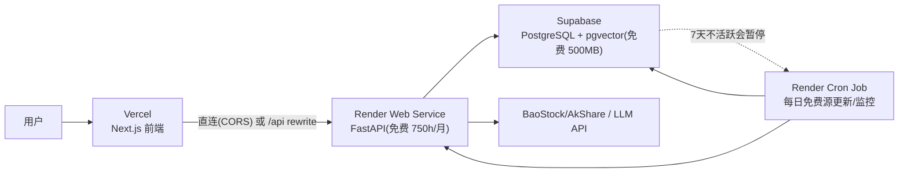

# 部署指南：Render（后端）+ Supabase（数据库）+ Vercel（前端）

> **选定方案**：全免费组合，去掉国内每日采集。
> 数据层全部用**免费源（BaoStock / AkShare）**，零积分、零 token。
> 选型理由见 [06-tech-stack.md](06-tech-stack.md)。

---

## 0. 目标架构



**模式说明**：全部服务走海外（Render 美东 / Supabase 新加坡 / Vercel 全球边缘），
无国内节点 —— 面向国内用户访问会有延迟波动，适合个人自用/演示/海外用户。

---

## 0.1 免费额度边界（2026 已核实）

| 服务 | 免费额度 | 对本项目 |
|---|---|---|
| Render Web Service | 512MB RAM / 0.1 CPU / 750 小时·月；**15 分钟无流量休眠**，冷启动 30–60s | API 个人低频够用；0.1 CPU 跑全量分析偏慢 |
| Render Cron | 免费层可用，按 crontab 调度 | 每日数据更新/监控 OK |
| Render 静态站 | 100GB 带宽/月 | 前端可托管（本方案用 Vercel） |
| Supabase | **500MB DB** / 1GB 存储 / 2 项目；**7 天不活跃自动暂停**；pgvector ✅ / TimescaleDB ❌ | 自选股 ≤100 只可容纳；每日写入即保活 |
| Vercel | Hobby 免费；函数时长有限 | 只做页面 + rewrites，长连接走直连 |

> ⚠️ 三个免费层政策都可能调整；免费 Postgres 过期问题已规避（Supabase 数据不删，只暂停）。

---

## 0.2 数据采集策略（无国内采集）

| 数据源 | 部署环境用法 | 说明 |
|---|---|---|
| **BaoStock（主·免费）** | Render 上直接调用 | **完全免费、无积分/token**，自带估值历史（peTTM/pbMRQ/psTTM）+ 季度财报 + 前复权日线 |
| **AkShare（分红专用）** | 组合数据源：分红走巨潮 `stock_dividend_cninfo` | 补 BaoStock 无分红缺口；本机（国内 IP）100% 可用，Render 海外连通性需 `data ping` 实测 |
| **AkShare（新浪/东财）** | 可放 Render，需实测 | 全免费、覆盖最全（行业/财报/日线/**10 年估值分位**/分红）；海外 IP 有被限流风险，`data ping` 实测通就能用 |
| LLM | DeepSeek / Qwen API | 无地域限制 |

> 💰 **免费方案（推荐起步）**：`config/settings.yaml` 已设 `primary: baostock`，回退链 `baostock → akshare → mock`；
> **分红由组合数据源自动走 AkShare 巨潮**（`combined(baostock+dividends:akshare)`），无需手动切换。
> **部署后先跑 `python -m value_agent data ping`**，实测各源连通性。

**按需 + 缓存**：用户分析某公司时才拉取（未缓存则实时取数），命中缓存直接分析；
**每日 cron**：只更新自选股池（≤100 只）的行情与财报，控制 Supabase 容量与数据源请求量。

---

## 1. Render 部署后端

### 1.1 准备

| 项 | 操作 |
|---|---|
| 账号 | Render 用 GitHub 登录，免费 Hobby 计划 |
| CLI | `npm i -g render-cli`，`render login`（或纯 GitHub 集成） |
| 代码仓库 | GitHub 推送，Render 自动部署 |

### 1.2 render.yaml 蓝图（`deploy/render.yaml` 模板）

```yaml
services:
  - type: web
    name: value-agent-api
    runtime: docker
    dockerfilePath: deploy/Dockerfile
    healthCheckPath: /health
    plan: free
    envVars:
      - key: DATABASE_URL
        sync: false            # 在控制台填 Supabase Pooler 连接串
      - key: LLM_API_KEY
        sync: false

  - type: cron
    name: value-agent-daily
    runtime: docker
    dockerfilePath: deploy/Dockerfile
    schedule: "0 18 * * *"     # 每天 18:00（UTC）更新数据 + 跑监控
    plan: free
    envVars:
      - key: DATABASE_URL
        sync: false
    # startCommand 在 Dockerfile CMD 覆盖为: python -m value_agent data update --daily && python -m value_agent monitor --daily
```

> `envVars.sync: false` 表示值在控制台手动设置，不进代码库。
> cron 服务与 web 服务共用镜像，CMD 覆盖成一次性任务（跑完退出，不计常驻小时）。

### 1.3 Dockerfile（`deploy/Dockerfile` 模板）

```dockerfile
FROM python:3.11-slim

WORKDIR /app
ENV PYTHONDONTWRITEBYTECODE=1 PYTHONUNBUFFERED=1

COPY pyproject.toml ./
COPY src ./src
RUN pip install --no-cache-dir .

# 免费数据源（BaoStock / AkShare）
RUN pip install --no-cache-dir baostock akshare

EXPOSE 8000
CMD ["sh", "-c", "uvicorn value_agent.main:app --host 0.0.0.0 --port ${PORT:-8000}"]
```

### 1.4 健康检查（Render 必需）

```python
# value_agent/main.py
from fastapi import FastAPI

app = FastAPI(title="Value Agent API")

@app.get("/health")
def health() -> dict:
    return {"status": "ok"}
```

### 1.5 环境变量

```text
DATABASE_URL=postgresql://...@aws-0-<region>.pooler.supabase.com:6543/postgres   # Supabase 事务池
LLM_PROVIDER=deepseek
LLM_MODEL=deepseek-chat
LLM_API_KEY=your_key
```

### 1.6 部署命令 / 流程

```bash
git push origin main          # GitHub 集成自动部署（或 render-cli: render deploy）
render logs --service value-agent-api   # 看日志
render open --service value-agent-api   # 打开 https://xxx.onrender.com
```

- 免费 Web Service 15 分钟无流量休眠 → 首次访问冷启动 30–60s，属正常。

### 1.7 Cron：每日数据更新 + 监控

- render.yaml 中 cron 服务每天 18:00（UTC）跑：
  `python -m value_agent data update --daily`（免费源更新自选股行情/财报 → 写 Supabase）
  `python -m value_agent monitor --daily`（触发监控规则 → 飞书/企微推送）
- cron 运行也**顺带给 Supabase 保活**（避免 7 天暂停）。

---

## 2. Supabase 数据库

### 2.1 创建项目

1. supabase.com 注册 → New project（区域选 **Southeast Asia / Singapore**，离国内近）。
2. 建表：在 Supabase SQL Editor 执行 [`src/value_agent/data/schema.sql`](../src/value_agent/data/schema.sql)（表结构 + 索引），再开启 `create extension vector;`（pgvector，RAG 用）。
   > schema.sql 由 `python -m value_agent data ddl` 从代码里的 SCHEMA 生成（单一事实源），改表结构后重新生成即可。

### 2.1.1 连接方式选择与排查（Troubleshooting）

| 连接方式 | 端口 | IPv4 | 免费 | 说明 |
|---|---|---|---|---|
| 直连 `db.<ref>.supabase.co` | 5432 | ❌ 需付费附加项 | 仅 IPv6 | 新版项目**仅 IPv6**；IPv4 是付费开启 → 免费场景不要用 |
| **Session Pooler** `aws-0-<region>.pooler.supabase.com` | **5432** | ✅ | ✅ | **免费首选**，适合常驻 FastAPI（本项目已用） |
| Transaction Pooler 同上 | 6543 | ✅ | ✅ | 适合无服务器/短连接（也可用） |

已配置（本仓库 `.env`）：`postgresql://postgres.<ref>:<密码>@aws-0-ap-southeast-1.pooler.supabase.com:5432/postgres`


| 现象 | 原因 | 解决 |
|---|---|---|
| `server closed the connection unexpectedly` | 连接串格式错（如 `postgres:` 后多 `@`）或网络 TLS 被拦截 | 先检查 `.env` 的 `DATABASE_URL` 格式：`postgresql://postgres:密码@host:端口/postgres`（密码含 `@` 需 URL 编码）；在**本机终端**跑 `uv run python -m value_agent data status --backend postgres` |
| 直连(5432)失败 | Supabase 直连需 **IPv6**，部分网络不通 | 改用 **Transaction Pooler** 连接串（端口 **6543**）：Supabase 控制台 → Project Settings → Database → Connection string → Transaction pooler |
| 沙箱/CI 内 TLS 全断 | 沙箱 NAT 代理不转发 TLS（198.18.x.x） | 在用户本机执行验证，不要依赖沙箱 |

> 备注：本开发沙箱 TLS 被拦截（BaoStock 非 TLS 可通、Supabase TLS 全断），
> 故 Supabase 连通性需你在本机终端验证。

### 2.2 连接（必须用 Pooler）

```text
# 事务池（推荐，适配 Render 无状态服务）
DATABASE_URL=postgresql://postgres.<ref>:<password>@aws-0-<region>.pooler.supabase.com:6543/postgres
```

### 2.3 扩展能力与限制

| 能力 | 情况 |
|---|---|
| pgvector（研报 RAG） | ✅ 内置支持 |
| TimescaleDB（行情超表） | ❌ 不可用 → 行情表用普通表 + `(ts_code, trade_date)` 复合索引；自选股 ≤100 只无需分区 |

### 2.4 保活策略

- **7 天不活跃自动暂停**（数据不删，恢复即用）。
- 保活来源：Render cron 每日写入行情（天然保活）；如某天没跑，dashboard 手动 Restore 或下次 API 调用自动唤醒（有延迟）。

### 2.5 容量规划（500MB）

| 数据 | 估算（≤100 只自选股） |
|---|---|
| 日行情 10 年 | ~30–80MB |
| 财报 10 年（季度） | ~20–50MB |
| 估值分位/指标 | ~10–30MB |
| RAG 向量（少量研报） | 控制在 ~50MB 内 |
| **合计** | ~150–250MB，**可容纳** |

> 超容量前先做两件事：只保留自选股、清理 10 年外数据；仍不够再开 Pro（$25/月）。

---

## 2.6 Render 部署步骤（Blueprint 方式，推荐）

1. **推送代码到 GitHub**（Render 支持 GitHub 集成自动部署）。
2. Render 控制台 → **New + → Blueprint** → 选择仓库 → 识别 `deploy/render.yaml`。
3. 首次构建后，在 **value-agent-api** 服务设置里填环境变量（蓝图已声明，值在控制台填）：
   ```text
   DATABASE_URL=postgresql://postgres.doiffzrpziubnqgovmir:密码@aws-0-ap-southeast-1.pooler.supabase.com:5432/postgres
   LLM_API_KEY=你的 key
   ```
4. 服务启动后访问 `https://<service>.onrender.com/health` → 应返回 `{"status":"ok"}`。
5. 跑连通性自检：Render 控制台 → Shell，执行
   ```bash
   python -m value_agent data ping
   ```
   - BaoStock/AkShare 从海外可达 → 数据可实时拉取；
   - 不可达 → **分析会自动读 Supabase 已入库数据**（存储优先，见 data/manager.py），不影响使用。
6. **数据刷新**：本地（国内）执行 `uv run python -m value_agent data update --daily` → 写入 Supabase；Render 只读。

> ⚠️ 免费层限制：web 服务 15 分钟无流量休眠、冷启动 30-60s；会话存于实例临时磁盘，
> 重启/换实例会丢（生产建议把 SessionStore 也迁到 Supabase，待做）。
> cron 服务按计划启动、跑完即退（不计常驻小时）。

## 3. Vercel 前端

### 3.1 环境变量

```text
NEXT_PUBLIC_API_BASE=https://value-agent-api.onrender.com   # 浏览器直连（SSE/长连接）
```

### 3.2 vercel.json（`deploy/vercel.json` 模板）

```json
{
  "$schema": "https://openapi.vercel.sh/vercel.json",
  "rewrites": [
    {
      "source": "/api/:path*",
      "destination": "https://value-agent-api.onrender.com/api/:path*"
    }
  ]
}
```

### 3.3 后端 CORS（直连必需）

```python
from fastapi.middleware.cors import CORSMiddleware

app.add_middleware(
    CORSMiddleware,
    allow_origins=["https://your-app.vercel.app", "http://localhost:3000"],
    allow_methods=["*"],
    allow_headers=["*"],
)
```

### 3.4 部署

```bash
cd frontend
vercel login
vercel --prod
```

### 3.5 国内访问说明

- `vercel.app` 与 `onrender.com` 在国内均不稳定（无优化线路）；
- 若以后要面向国内用户：前端改静态导出（`output: 'export'`）托管阿里云 OSS+CDN（域名备案），API 换国内部署 —— 见 §5 备选。

---

## 4. 端到端验收清单

- [ ] Render `/health` 返回 200，服务不反复重启
- [ ] 首次分析触发按需取数（BaoStock/AkShare）→ 入库 Supabase → 工作流跑完 → 备忘录生成
- [ ] 第二次分析命中缓存，不再重复取数
- [ ] Render cron 每日更新自选股并推送飞书/企微
- [ ] Supabase 7 天不暂停（每天有写入）
- [ ] CORS 白名单正确、环境变量无密钥泄露
- [ ] 容量监控：Supabase 用量 < 500MB

---

## 5. 备选方案（一句话）

| 场景 | 免费方案 |
|---|---|
| 数据量超 500MB | 控制自选股（≤100）、清理 10 年外历史；必要时本地 DuckDB 分析 |
| 免费源海外不通 | 本地运行 `data update --daily` 写入 Supabase（BaoStock/AkShare 本地可用） |
| 需要国内访问 | 免费边界为个人自用/演示；前端静态导出 + 国内 CDN（域名备案）可改善 |

---

## 6. 相关文件

```text
deploy/
├── render.yaml        # Render 蓝图：web + cron 服务（本方案主用）
├── Dockerfile         # FastAPI 镜像（含免费数据源 baostock/akshare）
└── vercel.json        # 前端 rewrites 模板
```
