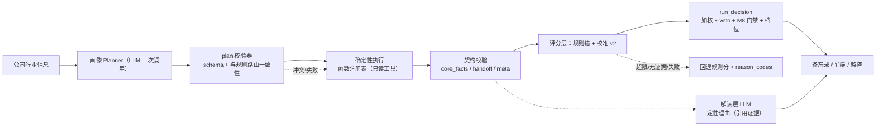

# 12. V2 升级方案：LLM 规划层 + 评分校准 v2

> 目标：在不破坏「数据与解释分离 / 可回测可审计 / 硬约束不可让渡」三条底线的前提下，
> 引入两层**受控**的 LLM 能力：
> 1. **规划层（Planner）**：LLM 按公司行业信息选择「跑哪些函数 / 路由 / 参数」——决定**做什么**；
> 2. **校准层（Calibration v2）**：LLM 在规则分基础上做「有界、须证据」的偏移——决定**分能动多少**。
>
> 状态：设计定稿（2026-08-08）。**P1 已落地（2026-08-08）**：`core/scoring.py` 完成 delta 制校准 + 证据校验 + 动态 cap + 档位保护，全量 417 测试通过。
> **P2 已落地（2026-08-08）**：`config/llm_calibration.yaml` 成为校准策略唯一事实来源（代码兜底 + 契约测试锁一致）；校准轨迹（`calibration_trace`）挂到 `ModuleResult.calibration` 并进决策快照，全量 425 测试通过。
> **P3 已落地（2026-08-08）**：校准 A/B 回放闭环——`src/value_agent/backtest/calibration_ab.py`（抽取/前向收益/相关对比/档位翻转/数据驱动建议）+ `scripts/calibration_ab.py`（读 `data/sessions.db` 语料 + `data/market.db` 行情，输出报告与 `llm_calibration.yaml` 修改建议），全量 438 测试通过。
> **P4 已落地（2026-08-08）**：画像 planner 试点（M1→M4）——`src/value_agent/planner/`（CompanyProfile 模型 + `parse_profile`/`resolve_profile` 校验器 + `stability_rate`），M1 的 LLM 分类调用升级为一次输出完整画像（business_type/financial_subtype/cyclicality/primary_metric/confidence），冲突策略 v2.1 起改为 **LLM 主判**（medium+理由/high 采纳 LLM，low/无理由回退规则），画像字段 + `plan_trace`（含 `llm_vs_rule`）进 M1 handoff、M2/M4/M7 消费同一份；`scripts/planner_stability.py` 验收 plan 稳定性。全量 451 测试通过。
> **P5 已落地（2026-08-08）——V2 全部完成**：① 接线——`confidence_from_completeness`（completeness→校准置信度），M1（画像/数据→meta.completeness→校准上限：plan 采纳→high→±5，冲突/降级→medium/low→±10/15）与 M4（数据降级/valuation_confidence→meta）接入；② 函数注册表——`src/value_agent/tools/`（ToolRegistry + 12 个估值方法登记 + 输入/输出 schema 校验 + `execute_plan` plan-then-execute）。全量 464 测试通过。

---

## 1. 背景与现状问题

现状（2026-08-08）：

- M1–M11 规则引擎产出 `core_facts`，LLM 只做定性解读（`docs/01-design.md` 原则）；
- 路由靠 YAML 枚举：`config/valuation_routing.yaml`（M4）、`config/financial_routing.yaml`（M2）、
  M7 `primary_metric`、M1 `handoff.valuation_route`；
- 评分：`src/value_agent/core/scoring.py` 的 `llm_score` 让 LLM **直接输出 0–100 绝对分替换规则分**；
  `src/value_agent/decision/engine.py` 的 `CALIBRATION_CAP = 15` 只保护 M10 总分；
- 硬约束：`config/scoring.yaml` 的 veto + M8 安全边际门禁，LLM 不可覆盖
  （`docs/progress.md` 2026-08-07 已修复「LLM 抬分冲掉门禁」）。

五个病根：

| # | 病根 | 后果 |
|---|---|---|
| 1 | 路由靠枚举 | 长尾行业 / 混合业态 / 边界案例覆盖不到 |
| 2 | 模块级 LLM 是绝对分替换 | 单模块可被 LLM 挪动 30 分；±15 保护太晚太粗 |
| 3 | 未分模块差异化 | 数值型模块（M2/M7/M8）也被 LLM 校准 |
| 4 | 无回测闭环 | LLM 校准有没有价值，没有任何机制验证 |
| 5 | 无规划层 | 行业信息只被 M1 分类，未系统性驱动 M2/M4/M7 的函数与参数选择 |

---

## 2. 设计原则（承接 01-design.md §1）

| 原则 | v2 落地含义 |
|---|---|
| 数据与解释分离 | 数字一律由确定性引擎产出；LLM 永不直接产数值结论 |
| 权限分层 | LLM 决定「做什么」（plan）；引擎决定「结果是多少」（score）；LLM 只负责「为什么」（reason） |
| 可回测可审计 | 每次 plan 与校准留 trace；`temperature=0`；输入哈希可回放 |
| 硬约束不可让渡 | veto / M8 门禁 / M10 档位，LLM 永不触碰 |
| 降级兜底 | LLM 失败 → 回退规则路由 + 规则分 + `reason_codes` |

---

## 3. 总体架构



**LLM 权限边界（一句话版）：**

| 层 | 谁主导 | LLM 能做什么 | LLM 不能做什么 |
|---|---|---|---|
| 规划层 | LLM（受校验器约束） | 选模块 / 函数 / 路由 / 参数 | 绕过校验器、触碰硬约束 |
| 执行层 | 确定性引擎 | 无 | — |
| 解读层 | LLM | 定性理由、新信息提取（须引用证据） | 编造数字 |
| 评分层 | 规则锚 + 有界校准 | 有界偏移（±5~15，须证据） | 给绝对分、否决 |
| 决策层 | 确定性 | 赞成 / 反对理由 | 覆盖 veto / 门禁 / 档位 |

---

## 4. 规划层：公司画像 Planner

### 4.1 范围：哪些模块需要 planner

判断标准（三条**同时成立**才需要）：

1. 有真实「选择」空间——函数 / 参数确实因行业而异；
2. 选项多到 YAML 枚举吃力——长尾覆盖不到；
3. 选择可验证——不涉及最终裁决 / 否决。

| 模块 | planner 价值 | 判断依据 | 建议 |
|---|---|---|---|
| M1 商业模式 | ⭐⭐⭐ 最高 | 行业识别是全局路由源头，长尾/混合业态枚举不全 | **要** |
| M2 财务质量 | ⭐⭐⭐ 高 | 分行业口径差异大：银行看拨备、券商看杠杆、地产看有息负债、制造看毛利率 | **要** |
| M4 估值 | ⭐⭐ 中高 | 方法组合 + 参数（WACC、增速上限）按生意类型变 | **要**（弱化版：只选方法/参数，不碰数值） |
| M7 价格情绪 | ⭐⭐ 中 | `primary_metric`（pe/pb/null）配置表外覆盖不到 | **要**（弱化版） |
| M3 成长 | ⭐ 中 | 估算方法与 cyclicality 行业相关，可选集小 | 可选（从画像间接继承） |
| M5 护城河 | ⭐ 中 | 同行选择、证据侧重行业相关 | 可选（低成本规则版：行业→peer 规则） |
| M8 安全边际 | ◐ 低 | 折扣由 moat×风险确定性算出 | 不需要，参数化已够 |
| M6 治理 | ✗ 不要 | 质押/减持/分红/审计是通用规则 | 纯确定性 |
| M9 风险 | ✗ 不要 | 聚合 + veto 候选是硬约束 | 纯确定性 |
| M10 决策 | ✗ 禁止 | 权重 + veto + 门禁，一票否决不可让渡 | **永远不给 planner** |
| M11 监控 | ✗ 不要 | 结构化规则生成，由 M10 驱动 | 纯确定性 |

**关键设计：不做 11 个模块各自的 planner，做一个「公司画像 planner」一次调用输出结构化画像**，
M1/M2/M4/M7 消费同一份，M3/M5 间接继承。理由：

- **一致性**：不会出现「M1 说周期、M7 却按消费选 PE」的打架；
- **成本**：一次调用替代 4–5 次分散调用；
- **好验证**：只需验证「一份画像是否稳定 + 与规则路由是否冲突」。

### 4.2 画像 schema

```json
{
  "schema_version": "1.0",
  "industry": "白酒",
  "business_type": "consumer_monopoly",
  "financial_subtype": null,
  "cyclicality": "low",
  "primary_metric": "pe",
  "special_flags": ["high_dividend", "state_owned"],
  "confidence": "high",
  "notes": "可选：一句话依据"
}
```

枚举约束（与现有路由配置对齐）：

```text
business_type     ∈ {cyclical, consumer_monopoly, growth, financial, asset_based, stable_dividend}
financial_subtype ∈ {bank, broker, insurance, real_estate, null, ...}
primary_metric    ∈ {pe, pb, null}
cyclicality       ∈ {low, medium, high}
confidence        ∈ {high, medium, low}
```

### 4.3 plan 校验器（Plan Validator）

| 检查 | 行为 |
|---|---|
| schema / 枚举非法 | 回退规则路由 + `reason_code: PLAN_INVALID` |
| 与规则冲突且 `confidence=low`，或 `medium` 未给理由 | business_type 回退规则路由（其余画像字段保留）+ warning 落 trace（`conflict_fallback`） |
| 与规则冲突且 `confidence=high`，或 `medium` 且给出理由 | 采纳 LLM 判断（记 `override` trace，`llm_vs_rule=conflict`，要求 LLM 给出理由） |
| LLM 失败 / 超时 / 解析失败 | 默认画像 `{business_type: null}` → 走现有规则兜底路由 |

> ✅ 已落地（2026-08-08，v2.1 更新 2026-08-08）：`planner/validator.py` 的 `parse_profile`（schema 校验）/ `resolve_profile`（LLM 主判 + 规则兜底）；
> M1 的 LLM 分类调用即画像调用（一次输出完整画像），`handoff.plan_trace`（含 `llm_vs_rule`）落审计，M2/M4/M7 消费同一份；M4 校准层不再覆盖 business_type。

### 4.4 消费方映射

| 消费方 | 读取字段 | v2 行为 |
|---|---|---|
| M1 | business_type / industry | 画像作行业先验，规则校验后产出 `handoff.valuation_route`；v2.1 冲突时 **LLM 主判**（medium+理由/high 采纳；low/无理由回退规则） |
| M2 | business_type / financial_subtype | 画像 → `financial_routing.yaml` 查表选口径 |
| M4 | business_type / financial_subtype | 画像 → `valuation_routing.yaml` 查表选方法 + 参数 |
| M7 | primary_metric | 画像 → 主指标选择 |
| M3 | cyclicality | 画像先验 + 规则校验 |
| M5 | industry / financial_subtype | 画像 → peer 选择（可选） |

### 4.5 为什么其他模块不需要

- **M6 治理**：质押 / 减持 / 分红 / 审计是通用规则，不因行业而异；
- **M8 安全边际**：要求折扣由 moat×风险确定性算出，参数化已够；
- **M9 风险**：风险聚合 + veto 候选是硬约束；
- **M10 决策**：权重 + veto + 门禁，一票否决不可让渡；
- **M11 监控**：结构化规则生成，由 M10 驱动。

---

## 5. 执行层：函数注册表（Tool Registry）

- 把确定性引擎函数登记为**带 schema 的只读工具**（不改造函数本身）；
- v2 采用 **plan-then-execute**：LLM 一次输出调用计划，引擎批量执行；**不用 agentic loop**
  （LLM 逐步调工具）——成本、可控性、可回放性都更好；
- 工具输出必须过 schema 校验才能进入下一步（防脏数据 / prompt injection）；
- 现有 outputs 契约（`docs/09-module-contracts.md`）不破坏：`core_facts / qualitative / signals / handoff / meta` 结构不变。

注册表示例：

| 工具 | 函数 | 输入 | 输出 |
|---|---|---|---|
| `valuation.dcf` | `valuation/methods.py::dcf` | eps, g, r, terminal_g, years | `{value, low, high, reason, confidence}` |
| `valuation.nav` | `valuation/methods.py::nav` | bvps, discount | `{value, ...}` |
| `financials.quality` | `financials/quality.py` 分行业规则 | business_type, financial_subtype | `{metrics, score, signals}` |
| `market.percentile` | `market/engine.py` | primary_metric | `{pe_percentile, pb_percentile, position}` |

> ✅ 已落地（2026-08-08）：`src/value_agent/tools/registry.py`——`ToolRegistry.register/execute/execute_plan` + 输入/输出 schema 校验；
> 已注册 **14 个工具**：12 个估值方法（`valuation.dcf` / `tang` / `graham_number` / `graham_formula` / `ddm` / `relative_median_pe` / `pb_band` / `pb_roe` / `peg` / `dcf_three_stage` / `nav` / `ncav`）
> + `financials.quality`（M2 分行业口径 → score/metrics/signals）+ `market.percentile`（M7 → pe/pb 分位 + position）。

---

## 6. 评分层 v2：Calibration v2

### 6.1 要解决的问题

1. `llm_score` 是绝对分替换 → 改成 **delta 制**；
2. 无证据约束 → 加 **证据锚定**；
3. 无动态上限 → 上限 = **f(规则置信度)**；
4. 未分模块差异化 → 按模块配置开关与上限；
5. 无档位保护 → 加 **band 边界保护**。

### 6.2 LLM 输出（结构化 JSON，替换现在的 `{score, reason}`）

```json
{
  "delta": -15,
  "reasons": ["理由1", "理由2"],
  "evidence_refs": [0, 2],
  "new_facts": ["规则层未覆盖的新事实（须可溯源）"],
  "confidence": "medium"
}
```

### 6.3 校验规则

| # | 规则 | 行为 |
|---|---|---|
| 1 | delta 超模块上限 | 截断到上限，记 evidence: `CALIBRATION_CAPPED` |
| 2 | 上限 = f(规则置信度) | `meta.confidence` high→±5 / medium→±10 / low→±15 |
| 3 | 抬分须证据 | `delta>0` 且 `evidence_refs+new_facts` 为空 → 拒绝，回退规则分 |
| 4 | 压分宽松 | `delta<0` 只需 ≥1 条理由（审慎原则，对齐 `moat.downgrade_requires_evidence: false`） |
| 5 | 档位边界保护 | 抬分跨档且 base 距 band 阈值 <5 分时，需 `new_facts ≥ 2` 条，否则封顶在档内（压分不加此保护——审慎原则下压分只需理由，避免误伤保守修正） |
| 6 | 降级回退 | LLM 失败 / 解析失败 → 规则分 + `reason_codes`（沿用现有） |

最终分 = `clamp(base_score + delta, 0, 100)`，**永不直接采纳 LLM 绝对分**。

### 6.4 分模块策略

| 模块 | 性质 | 策略 |
|---|---|---|
| M2 财务 / M7 估值位置 / M8 折扣 | 纯数值，有公式 | **禁用校准**（cap 0）或 ±3，LLM 只给理由 |
| M1 商业模式 / M5 护城河 / M6 治理 | 语义判断 | 校准 ±10~15，**必须证据** |
| M3 成长 / M9 风险 | 半数值半语义 | 校准 ±10，新信息须标注来源 |
| M10 决策 | 最终结论 | **不校准**（现状已对），LLM 只出赞成/反对理由 |
| veto / M8 门禁 | 硬约束 | LLM 永不触碰（现状已对） |

### 6.5 配置：`config/llm_calibration.yaml`

```yaml
calibration:
  M2_financial_quality: {enabled: false, cap: 0}
  M5_moat:              {enabled: true, cap: 15, require_evidence: true, require_evidence_for_up: true}
  M10_decision:         {enabled: false, cap: 0}
default:                {enabled: true, cap: 10, require_evidence: true, require_evidence_for_up: true}
band_protection:        {margin: 5, min_new_facts_to_cross: 2}
```

### 6.6 与规划层的联动（关键接线）

```
画像 completeness → meta.confidence → 校准上限
```

- planner 选的路由数据齐全 → `completeness: high` → 校准上限 ±5（LLM 无权大动）；
- planner 引入降级路径（如选 NAV 但资产负债表明细缺失 → `DATA_UNAVAILABLE`）→ `completeness: low`
  → 上限 ±15，但证据要求更严。

即：**planner 开的路越窄，LLM 校准权限越大，但证据门槛越高**——两层天然互补，互相兜底。

> ✅ 已落地（2026-08-08）：`core/scoring.py::confidence_from_completeness` + M1/M4 接线。
> M1：plan 采纳 → completeness high → 校准上限 ±5；冲突回退/数据降级 → medium/low → ±10/15。
> M4：数据降级 → low；valuation_confidence ≥0.7 → high；否则 medium。

---

## 7. 决策层（保持不变）

- `run_decision`：加权求和 + veto + M8 门禁 + 档位（`config/scoring.yaml`）；
- LLM 只做 8.3 定性理由（白名单清洗，≤3 条、每条 ≤80 字）；
- 回归保护：LLM 校准后的最终总分仍走**同一个决策函数**（`docs/progress.md` 2026-08-07 修复点）。

---

## 8. 验证闭环：回测 A/B + trace

### 8.1 两条独立 A/B（分轨验证，避免混淆归因）

1. **校准 A/B（固定路由）**：同数据跑 `纯规则分` vs `规则 + 校准 v2`
   → 对比 分数与未来收益相关性 / 档位翻转率 / delta 饱和与偏置（✅ 已落地：
   `backtest/calibration_ab.py` + `scripts/calibration_ab.py`，语料=会话 `ModuleResult.calibration`）；
   ✅ 模块级评分的 PIT 组合级回测已落地（2026-08-08）：`run_backtest(score_fn=...)` + `backtest/module_score.py::module_pit_score`
   （M1 规则分类 → M2 财务质量引擎 + M4 估值引擎便宜度），`scripts/backtest_module.py` 对比基线与模块流水线的 PIT 超额；
2. **规划 A/B（固定校准）**：`规则路由` vs `planner 路由`
   → 对比 plan 稳定性（同 seed 5 次）/ 与规则路由冲突率 / 端到端收益。

### 8.2 结论驱动开关

- 某模块校准在回测无稳定增益 → `enabled: false`；
- 有增益但幅度偏大 → 收窄 cap；
- 画像某维度波动大 → 降 confidence 或回退规则路由。

### 8.3 trace 落库（进分析快照）

- `plan_trace`：{画像, 校验结果, 是否回退, 理由}；
- `calibration_trace`：每模块 {规则分, delta, 理由, evidence_refs, new_facts, 是否拒绝, 最终分}；
- 月度监控：校准分布（若系统性偏高/偏低 → 调 prompt 或收窄 cap）。

### 8.4 可复现性

- 评分 / 规划调用 `temperature=0`；
- trace 含输入哈希，可回放同一输入验证。

---

## 9. 分阶段落地路线

| 阶段 | 内容 | 验收标准 | 是否碰路由 |
|---|---|---|---|
| **P1** ✅ 已落地（2026-08-08） | 评分层 v2：delta + 证据校验 + 动态 cap + 档位保护 | 417 测试全绿（含新增校准测试）；无 LLM 时行为不变 | 否 |
| **P2** ✅ 已落地（2026-08-08） | 配置化 + trace 落库 | `config/llm_calibration.yaml` 生效（代码兜底 + 契约测试）；`ModuleResult.calibration` + 决策快照含 `calibration_trace` | 否 |
| **P3** ✅ 已落地（2026-08-08） | 回测 A/B 闭环 + per-module 开关 | `scripts/calibration_ab.py` 可跑（含空语料引导）；每模块 `enabled/cap` 由校准轨迹数据驱动（相关增益/翻档率/delta 饱和/偏置） | 否 |
| **P4** ✅ 已落地（2026-08-08） | 画像 planner + plan 校验器（M1→M4 试点） | `planner/` schema 校验 + 冲突回退；`handoff.plan_trace` 落审计；`scripts/planner_stability.py` 验收 plan 稳定性（阈值 0.8） | 是（仅试点） |
| **P5** ✅ 已落地（2026-08-08） | 接线：画像 → `meta.confidence` → 校准上限联动 + 函数注册表扩展 | `confidence_from_completeness` + M1/M4 meta 接线（端到端测试覆盖）；`tools/` 注册表 12 个估值方法 + schema 校验 + `execute_plan` | 是（全量） |

每阶段独立提交、独立回滚（配置开关兜底）。

---

## 10. 风险与缓解

| 风险 | 缓解 |
|---|---|
| 成本 / 延迟上升 | 画像一次调用；校准 `temperature=0`；按模块开关；输入哈希缓存 |
| 确定性 / 可复现 | `temperature=0` + trace + 输入哈希回放 |
| prompt injection / 脏数据 | 工具输出 schema 校验；`new_facts` 须标注来源 |
| LLM 系统性偏差 | 月度校准分布监控；回测 A/B 开关 |
| 规则与 LLM 打架 | 校验器回退规则路由；冲突记 warning 落 trace |

---

## 11. 附录：schema 汇总

| 内容 | 位置 |
|---|---|
| 画像 schema | §4.2 |
| 校准 delta schema | §6.2 |
| `llm_calibration.yaml` | §6.5 |
| tool 注册表条目 | §5 |
