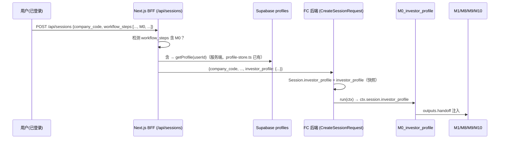

# 13. 投资者画像智能体（M0）设计与注入方案

> 目标：新增一个 **投资者画像智能体**（`M0_investor_profile`），把「个人信息」里的
> 学历教育背景、投资风格（以及已有的能力圈/风险承受/持有期/资金属性等字段）转成结构化画像，
> 注入 **M1（商业模式/能力圈）、M8（安全边际）、M9（风险）** 等模块，
> 让系统回答的不再是「这家公司能不能被理解」，而是 **「这个投资者能不能理解这家公司」**，
> 并据此个性化调整要求折扣与风险提示。
>
> 状态：设计稿 v2（2026-08-09）。v2 修订（按产品反馈）：
> 1. **M0 不进默认标准分析流**，作为可选智能体注册，由用户在自定义工作流里自选添加；
>    注入点改为「M0 在流中 → 消费，不在流中 → 中性兜底」，默认流全链路零回归。
> 2. **隐私约束放宽**：LLM 请求不含任何可直接定位身份的 PII（姓名/邮箱/手机/用户 id），
>    因此**完整画像字段（含 education_note、收入/资产档位）都可以给 LLM** 做个性化叙述；
>    只保留「剥离 PII + memo/evidence 不回显原始敏感值 + profile_used 审计」。

---

## 1. 背景与现状

- 前端已有完整投资者资料（`profiles` 表 + settings/profile 页面），字段含：
  `education_level / education_major / education_note / career_stage / annual_income_range /
  investable_assets_range / loss_tolerance_range / capital_availability / income_dependency_level /
  investment_goal / holding_period / risk_tolerance / investment_style / circle_of_competence /
  decision_preference`。
- **后端尚不消费这些字段**：M1 的「可理解性/能力圈」是公司侧通用判断（按生意类型给
  `能力圈内 / 边缘 / 圈外`），同一家公司对所有投资者输出同一结论；M8 要求折扣只由
  `生意类型 × moat × 风险` 决定；M9 风险清单不针对个人。
- v2 已有「公司画像」（CompanyProfile + planner 校验器 + plan_trace 审计）先例，
  本设计复用同一套「**画像 → 校验 → 注入 → 审计**」模式，只是画像主体从「公司」换成「投资者」。

### 核心差距

| 现状 | 问题 | 本方案 |
|---|---|---|
| M1 可理解性是公司侧固定评级 | 能力圈是**投资者属性**，与学历/专业/自报能力圈强相关 | 公司复杂度 × 个人胜任分 = 个人可理解性 |
| M8 要求折扣无个人维度 | 看不懂的生意、低风险承受、短期资金应要求更高折扣 | `persona_adjustment` 叠加因子 |
| M9 风险清单千人一面 | 高风险承受/长期资金与低风险/短期资金的风险优先级不同 | 个人风险提示 flags（不碰 veto 硬约束） |
| M10 仓位建议未考虑个人 | 低风险承受/资金可能急用的人不该按基准仓位建仓 | 个人仓位上限 cap |

---

## 2. 新 Agent 规格

```python
class M0InvestorProfileAgent(Agent):
    spec = AgentSpec(
        id="M0_investor_profile",
        name="投资者画像智能体",
        description="学历/投资风格/能力圈 → 个人可理解性评级 + 安全边际/风险注入参数"
                    "（可选：加入自定义工作流即生效，默认流不包含）",
        inputs=[],            # 无依赖，可放在工作流任意靠前位置
        requires_llm=False,   # 规则为主（确定性）；可选 LLM 一句话画像叙述
        version="0.1.0",
    )
```

### 2.1 输入（来自哪里）

`AgentContext.session.investor_profile`（创建会话时由前端 BFF 附加的快照 dict，见 §6）。
- **仅当用户选择的工作流包含 M0** 时，BFF 才附加 `investor_profile`（按需发送，避免无关请求携带个人数据）。
- 空 / 缺失 → 全中性输出（`meta.degraded=True`），M1/M8/M9/M10 走现状逻辑，默认流零回归。

### 2.2 输出（统一 ModuleResult）

```python
ModuleResult(
    module="M0_investor_profile",
    status=DONE,
    score=compliance_score,            # 画像完整度/一致性分（非投资评分）
    outputs={
        "persona_summary": "经管硕士 · 价值型 · 低风险承受 · 长期闲钱",   # 一句话画像
        "competence": {
            "dimensions": {             # 每个能力维度的个人胜任分（0-100）
                "consumer":   {"score": 82.0, "level": "in_circle",  "reasons": ["硕士+15", "自报能力圈+20"]},
                "finance":    {"score": 74.0, "level": "in_circle",  "reasons": [...]},
                "technology": {"score": 55.0, "level": "edge",       "reasons": [...]},
                # ... manufacturing / healthcare / energy / utilities / real_estate / internet
            },
            "overall_level": "medium",   # high|medium|low（个人综合可理解性）
            "matched_circle": ["consumer", "finance"],   # 命中投资者自报能力圈
        },
        "handoff": {                     # M1/M8/M9/M10 消费的契约字段
            "competence_level": "medium",                # M1：个人可理解性综合评级
            "circle_match": {"consumer": True, "finance": True},  # M1：维度命中（按公司维度）
            "required_discount_adjustment": 0.05,        # M8：要求折扣增量（0 为中性）
            "risk_amplification": {                      # M9：个人风险提示
                "tone": "cautious",                      # cautious|neutral|aggressive
                "flags": [
                    "超出投资者能力圈，难以评估（finance 维度）",
                    "高风险承受不足：最大回撤容忍低，波动风险前置",
                ],
            },
            "position_cap": 0.10,                       # M10：个人仓位上限（None=不限制）
            "profile_used": ["education_level", "education_major",
                             "investment_style", "risk_tolerance",
                             "circle_of_competence"],   # 审计：实际消费了哪些字段
        },
        "llm_qualitative": {...} | None,  # 可选：LLM 一句话画像叙述（可含完整画像字段，见 §9）
    },
    evidence=[
        "个人画像：学历=硕士，专业=经管金融，风格=价值，风险承受=低，能力圈=[消费,金融]",
        "能力圈匹配：finance 维度 in_circle（74 分）；technology 维度 edge（55 分）",
        "安全边际注入：要求折扣 +0.05（competence=medium + 低风险承受 + 长期闲钱）",
    ],
    meta={"confidence": 1.0, "completeness": "high"|"medium", "degraded": False, "reason_codes": []},
)
```

---

## 3. 画像模型（对齐前端枚举，白名单清洗）

新增 `src/value_agent/profile/models.py`，字段与 `frontend/src/lib/profile.ts` 枚举一一对应：

```python
@dataclass
class InvestorProfile:
    education_level: str | None = None      # high_school|associate|bachelor|master|doctor|other
    education_major: str | None = None      # science_engineering|economics|law|medicine|humanities|arts|other
    education_note: str = ""                # 自由文本（v2：可进 LLM，但剥离 PII）
    career_stage: str | None = None         # student|early_career|mid_career|senior|retired|freelancer
    investment_style: str | None = None     # value|growth|dividend|balanced|contrarian|event_driven
    risk_tolerance: str | None = None       # low|medium|high
    holding_period: str | None = None       # short_term|mid_term|long_term
    investment_goal: str | None = None      # capital_preservation|steady_growth|long_term_compounding|aggressive_return
    loss_tolerance_range: str | None = None # loss_lt_5|...|loss_gt_30
    capital_availability: str | None = None # long_term_idle|mid_term_idle|may_need_1_3y
    income_dependency_level: str | None = None  # low|medium|high
    decision_preference: str | None = None  # margin_of_safety|growth_upside|balanced
    circle_of_competence: list[str] = field(default_factory=list)  # consumer|finance|technology|...
    # 资金档位（v2：可进 LLM，但不进 memo/evidence 原文）
    annual_income_range: str | None = None
    investable_assets_range: str | None = None

    def filled(self) -> list[str]: ...   # 非空字段名清单（审计用）
    def to_dict(self) -> dict: ...
```

- `parse_investor_profile(raw: dict | None) -> InvestorProfile`：白名单清洗，非法枚举值丢弃、
  未知键忽略，`circle_of_competence` 只取合法值且上限 5 个。
- 校验规则可复用 v2 planner 的「非法 → 降级」策略：**任何字段非法只丢该字段**，不整体失败。

---

## 4. 能力圈评分引擎（规则，确定性）

新增 `src/value_agent/profile/engine.py`。原则：**个人胜任分 = 学历基础分 + 专业加成 + 自报能力圈加成 + 风格加成 + 职涯加成**，夹逼 0–100；生意类型决定"这家公司需要哪些维度"。

### 4.1 生意类型 → 所需能力维度（与 M1 business_type 对齐）

| M1 business_type | 所需维度（primary） | 说明 |
|---|---|---|
| consumer_monopoly | consumer | 消费/品牌直觉 |
| growth | technology / healthcare / internet | 成长赛道与估值逻辑 |
| cyclical | manufacturing / energy / real_estate | 周期/产能/价格认知 |
| financial | finance | 会计与监管专识 |
| asset_based | real_estate / manufacturing | 资产质量判断 |
| stable_dividend | utilities | 类债资产与分红 |

### 4.2 个人 → 各维度胜任分

| 输入 | 规则（示意，参数进 `config/profile_scoring.yaml` 可调） |
|---|---|
| 学历基础分 | high_school 40 / associate 50 / bachelor 60 / master 75 / doctor 85 / other 50 / 未填 55（中性） |
| 专业加成 | economics→finance +15、通用财务 +10；science_engineering→technology/manufacturing +10；law→finance/治理 +10；medicine→healthcare +15；humanities→consumer +5；arts→consumer +5 |
| 自报能力圈 | 命中维度 +20（已 self-declared，权重最高） |
| 投资风格 | value→consumer/finance +5；growth→technology/internet +5；dividend→utilities +10；contrarian→cyclical +5；event_driven→financial +5 |
| 职涯加成 | senior/retired +5（实务经验），student 0 |

### 4.3 维度分 → 可理解性等级

| 胜任分 | 等级 | 含义 |
|---|---|---|
| ≥ 70 | in_circle | 能力圈内 |
| 50–69 | edge | 边缘，需借助专业资料 |
| < 50 | out_circle | 圈外，难理解 |

**综合评级** `overall_level`：公司所需 primary 维度全部 in_circle → high；
任一 out_circle 且无匹配自报能力圈 → low；其余 → medium。
（与 M1 现有 `_understandability_level` 的 high/medium/low 枚举完全一致，可无缝对接。）

### 4.4 注入参数派生（确定性）

| 场景 | 派生 |
|---|---|
| competence_level=low | `required_discount_adjustment += 0.05~0.10`（圈外生意要求更高折扣） |
| competence_level=medium | `+= 0.00~0.03` |
| risk_tolerance=low | `+= 0.05`，risk_amplification.tone=cautious |
| capital_availability=may_need_1_3y | `+= 0.05`，波动/流动性风险前置 |
| decision_preference=margin_of_safety | `+= 0.03` |
| holding_period=short_term | 风险 flags：流动性/事件风险前置；`position_cap` 收窄 |
| income_dependency_level=high | 风险 flags：本金损失风险加重 |
| 未填/空画像 | 全为 0 / 中性，**不放大不缩小** |

`required_discount_adjustment` 最终并入 M8 的要求折扣公式（与 M7 的 `margin_adjustment`
同级、同样夹逼 `[0.2, 0.6]`，见 §5.2）。

---

## 5. 注入点设计（核心）

> 通用原则：**M1/M8/M9/M10 一律通过 `ctx.inputs.get("M0_investor_profile")` 读取**。
> M0 在自定义工作流中 → 消费其 `handoff`；M0 不在（默认流）→ 走现状逻辑（中性兜底），
> **任何注入都不改变默认流行为**，M0 是纯增量、可回退。

### 5.1 M1 —— 个人可理解性（核心注入）

M1 现有输出 `understandability` 是公司侧评级。改造后：

1. **规则层**：`personal_understandability = min(公司侧复杂度, 个人维度胜任分等级)`——
   公司侧已经判"圈外"的生意，个人再强也是圈外；公司侧"能力圈内"的生意，个人维度分
   决定是否降为边缘/圈外。输出同时保留：
   - `understandability`：**个人可理解性**（前端默认展示）
   - `understandability_company`：公司侧原值（对照/审计）
   - `handoff.understandability_level`：个人评级（M4 保守度消费链不变）
   - `handoff.competence`：M0 的维度匹配明细
2. **LLM 层**：M1 的 LLM system prompt 追加「投资者画像块」——以**这个投资者**的身份
   判断可理解性（v2：可传完整画像字段，含 education_note 与资金档位；见 §9）。
3. M0 不在流中 → 完全维持现状（无画像块，普通投资者视角）。

### 5.2 M8 —— 个性化要求折扣

`run_safety_margin` 新增参数 `persona_adjustment: float = 0.0`，在确定性分级公式里
与 `margin_adjustment` 同位叠加：

```python
req = base × moat 修正 × 风险修正 + margin_adjustment + persona_adjustment  # 夹逼 [0.2, 0.6]
```

- M8 agent 从 `ctx.inputs.get("M0_investor_profile")` 读取 `required_discount_adjustment`；
  M0 不在流中 → `persona_adjustment=0.0`（现状）。
- **不改** M10 的「安全边际门禁」与 buy_tranches 结构（硬约束不动），
  只让"要求折扣"更严/更松，从而移动买入区间与分批档位。
- `assumptions.required_discount`（用户手动覆盖）优先级最高，persona_adjustment 仍并入
  （手动覆盖只是跳过确定性公式，不跳过显式叠加——与 M7 margin_adjustment 同规则）。

### 5.3 M9 —— 个性化风险提示

- 在 M9 的 `outputs` 新增 `personal_flags: list[str]` + `handoff.personal_risk_tone`，
  内容来自 M0 `risk_amplification`：
  - 能力圈外维度 → 「该风险超出投资者能力圈，难以独立评估，建议借助专业资料」；
  - 低风险承受 / 高收入依赖 → 「本金损失风险加重，最大回撤容忍度低」；
  - 短期资金 → 「波动/流动性风险前置」。
- **不触碰 veto / monitor_candidates 的硬约束**：personal_flags 只是提示与展示，
  一票否决仍由 M9 规则与红队高置信路径决定（LLM 不可覆盖）。
- M0 不在流中 → 不输出 personal_flags（现状）。

### 5.4 M10 —— 个人仓位上限（可选增强，默认关闭）

- `position_cap`：`risk_tolerance=low → 0.10`、`holding_period=short_term → 0.05 或仅观察`、
  `capital_availability=may_need_1_3y → 0.05`；取最小值，夹逼现有 `[0, 25%]` 之上限。
- 与「M8 门禁 / 一票否决」同属硬约束层：`apply_band` 后 `position = min(position, cap)`。
- 默认 `position_cap=None`（不限制），避免改变现有回测口径；配置项开关进 `config/profile_scoring.yaml` 的 `position_cap.enabled`（默认关闭）。

---

## 6. 数据流：画像从哪来

### 方案 A（推荐）：前端 BFF 附加画像快照（仅当工作流含 M0）



- 与现有 `llm_config` 附加模式一致（前端取用户上下文 → 会话创建时附带）。
- **按需发送**：只有用户选的工作流含 M0 才附加画像，默认流不发（最小化个人数据流转）。
- **快照语义**：个人资料改动只影响**新会话**，历史会话/memo 不受扰动，审计友好。
- 隐私：个人资料在 BFF 服务端读取（token 已鉴权），浏览器侧不额外接触明文路径。

### 方案 B（备选）：后端按 JWT sub 查 Supabase

后端在 M0 里用 `DATABASE_URL`/Supabase 查 `profiles` 表。
缺点：后端引入 DB 直连耦合、profile 变更影响历史会话语义、无快照审计。
**不推荐**，除非后续有"跨会话实时生效"的强需求。

### 配套改动

| 位置 | 改动 |
|---|---|
| `sessions/models.py` | `Session.investor_profile: dict | None`（to_dict/from_dict 序列化；不含 PII 字段） |
| `main.py` | `CreateSessionRequest.investor_profile: dict | None` → 透传给 `create_session` |
| `sessions/manager.py` | `create_session(..., investor_profile=...)` 落 Session |

---

## 7. 工作流接线：M0 不进默认流，由用户自选

- **默认工作流（`config/workflows/default.yaml` + `workflow/defaults.py`）不改**：
  M1→M11 照旧，M0 不在其中 → 默认流行为零变化。
- `agents/builtin.py` 注册 `M0InvestorProfileAgent()` → `agent list` 可枚举，
  前端工作流构建器（`LOCAL_AGENTS`）可选中添加。
- **用户自选方式**：
  1. 前端工作流构建器里把 `M0_investor_profile` 拖入自定义流（`workflow_steps`）；
  2. 或分析页提供开关「使用我的投资者画像（M0）」→ 一键把 M0 步骤加入默认流前端步骤列表
     （仍走 `workflow_steps` 内联，不污染后端默认流定义）。
- 自定义流示例：

```yaml
# 用户自定义流：标准链 + 投资者画像（M0 在前）
id: personalized
name: 个性化价值分析
steps:
  - {id: M0, agent: M0_investor_profile}
  - {id: M1, agent: M1_business_model,        deps: [M0]}
  - {id: M2, agent: M2_financial_quality,     deps: [M1]}
  - {id: M4, agent: M4_valuation,             deps: [M1, M2, M5, M6]}
  - {id: M5, agent: M5_moat}
  - {id: M6, agent: M6_governance}
  - {id: M7, agent: M7_market,                deps: [M1]}
  - {id: M8, agent: M8_safety_margin,         deps: [M0, M4, M7, M5, M2]}
  - {id: M9, agent: M9_risk,                  deps: [M0, M2, M4, M5, M6, M7, M8]}
  - {id: M10, agent: M10_decision,            deps: [M0, M1, M2, M4, M5, M6, M7, M8, M9]}
  - {id: M11, agent: M11_monitor,             deps: [M10]}
```

- **`MODULE_DEPENDENCIES` 不改**：M0 不是 ModuleName 枚举成员，跟随既有自定义智能体
  （如 M12_esg_rating）的语义——重算只作用于用户显式勾选的模块，不进入内置依赖链。
- 注入方（M1/M8/M9/M10）不声明对 M0 的硬依赖（`spec.inputs` 不加 M0），
  只在运行期 `ctx.inputs.get("M0_investor_profile")` 探测：有则消费、无则兜底。
  —— 这样自定义流把 M0 放在任何位置（甚至 M1 之后）都不破坏拓扑。

---

## 8. 前端

| 位置 | 改动 |
|---|---|
| `frontend/src/lib/agents/catalog.ts` | `LOCAL_AGENTS` 加 `M0_investor_profile`（code=M0、图标、tagline、description、category=画像），`AGENT_ICONS` 加对应图标 key |
| `frontend/src/lib/agents/catalog.ts` | 构建器/详情页据此可选中 M0（`findAgent` 自动生效） |
| `frontend/src/app/api/sessions/route.ts` | 创建会话时检测 `workflow_steps` 含 M0 → 服务端 `getProfile(user.id)` → body 附 `investor_profile` |
| `frontend/src/hooks/use-workflow-run.ts` | `SessionView` 类型加 `investor_profile?`（透传展示用，可不改） |
| `frontend/src/components/workflow/module-outputs.tsx` | 新增 M0 渲染卡：能力圈匹配（维度清单/等级）、个性化要求折扣增量、个人风险提示 flags；`M0Outputs` 注册进组件映射 |
| `frontend/src/components/workflow/memo-card.tsx` | 备忘录加「投资者画像」小节（persona_summary + 注入摘要，**不回显收入/资产原文**）；模块名映射加 M0 |
| settings/profile 页面 | 数据源不变，无需改 |

---

## 9. 隐私与安全（v2 修订）

1. **LLM 可收完整画像字段**：LLM 请求不含任何可直接定位身份的 PII（姓名/邮箱/手机/用户 id），
   模型无法把画像对应到具体的人 → `education_note`、收入/资产档位（本就是区间档位，非精确金额）
   **允许进 LLM prompt**，用于更贴近的个性化叙述。
2. **剥离 PII 是硬约束**：任何进 LLM / 落库的画像数据必须先剔除 `display_name / email / phone /
   avatar / user_id` 等身份字段；`education_note` 进 LLM 前同样做一次 PII 扫描/截断。
3. **memo / evidence 保守展示**：只写派生结论（persona_summary、注入摘要），
   **不回显收入/资产原文与自由文本 note**——备忘录可能被分享/打印，不做明文敏感展示。
4. 空画像 → 中性降级（`meta.degraded=True`，行为与现状一致），不强制填写、不弹窗打扰。
5. 审计：`handoff.profile_used` 记录实际消费字段；evidence 只写派生结论，不回显原始敏感值。
6. `Session.to_dict` 序列化 `investor_profile` 时同样剔除 PII 字段（与 llm_config.api_key 同策略）。

---

## 10. 测试计划

| 测试 | 覆盖 |
|---|---|
| `tests/test_investor_profile.py` | parse 白名单清洗（非法枚举丢弃）、空画像中性、能力圈评分各等级边界 |
| `tests/test_investor_profile.py::test_m1_injection` | 自定义流含 M0：M1 个人可理解性 = min(公司侧, 个人)；M0 不在流中：M1 回退公司侧原值 |
| `tests/test_investor_profile.py::test_m8_persona_adjustment` | 要求折扣叠加与夹逼 [0.2,0.6]；手动 required_discount 优先级；无 M0 时 persona_adjustment=0 |
| `tests/test_investor_profile.py::test_m9_personal_flags` | personal_flags 生成；veto 不被个人画像覆盖；无 M0 时不输出 |
| `tests/test_investor_profile.py::test_m10_position_cap` | 低风险/短期资金 → position 上限生效；cap=None 不限制 |
| `tests/test_workflow.py` | **默认工作流不含 M0（回归不变）**；自定义工作流含 M0 可执行、注入生效 |
| `tests/test_contracts.py` | M0 handoff 契约字段枚举对齐（competence_level ∈ high/medium/low）；PII 剥离断言 |

---

## 11. 验收标准

- [ ] `agent list` 可枚举 `M0_investor_profile`；**默认工作流不含 M0，全链路行为与现状一致（回归无损）**
- [ ] 前端工作流构建器可选中 M0；分析页可选「使用我的投资者画像」开关
- [ ] 含 M0 的自定义流：同一家公司 M1 可理解性、M8 要求折扣、M9 提示随画像可区分
- [ ] 空画像 / 未选 M0：全链路输出与现状一致
- [ ] PII 剥离断言：姓名/邮箱/手机/用户 id 不进 LLM、不进 memo、不进落库画像
- [ ] memo/evidence 不回显收入/资产原文与 education_note（只出派生结论）
- [ ] M8 门禁 / M9 veto / M10 档位硬约束不被个人画像覆盖
- [ ] 前端：BFF 按需附加画像快照；M0 卡片渲染；备忘录有画像小节
- [ ] 全量单测通过（当前 464 → 新增后全绿）

---

## 12. 已落地加固（2026-08-09）

> 承接「随便连」评估：两个短板已补，见下文。

### 12.1 P0：局部重算支持自定义智能体与自定义拓扑

- **依赖图从会话工作流推导**：`sessions/manager.py` 新增 `_affected_by_session` /
  `_topo_order` / `_ordered_by_session`——自定义流按 `workflow_steps` 的 deps 推导
  下游级联与执行顺序，默认流回退内置 `MODULE_DEPENDENCIES`（行为不变）。
- **rerun 接受任意 agent id**：`M0_investor_profile` 等自定义智能体可增量重算，
  不再 `AttributeError`（旧实现只认内置 ModuleName）；会话中无该模块结果时补 PENDING 占位。
- **API**：`POST /api/sessions/{id}/rerun` 去掉 `ModuleName` 强转，返回 `rerun_order`（agent id 列表）。
- 测试：`tests/test_sessions.py` 新增自定义流级联重算 / 占位 / 默认流回归三条。

### 12.2 输出自描述（manifest）试点（M0）

- **`AgentManifest`**（`agents/base.py`）：静态、每 agent 一份——`summary` +
  `output_fields`（字段路径 → 含义）+ `how_to_consume`（下游怎么处理、缺失怎么兜底）。
  挂在 `AgentSpec.manifest`，**不随每次运行重复序列化**（只有一句 `outputs["summary"]` 进结果）。
- **M0 试点**：manifest 声明 `competence.dimensions` / `handoff.competence_level` /
  `required_discount_adjustment` / `risk_amplification` / `position_cap` / `profile_used`
  的含义与消费方式。
- **通用 helper `format_inputs_for_llm(inputs)`**：把 `ctx.inputs` 整理成
  「来源 agent id + 一句话 summary」文本；M10 的 LLM 提示词已接入，
  让下游 LLM 知道收到的数据来自哪些 agent、分别是什么（含自定义 agent）。
- 契约测试：`tests/test_investor_profile.py` 断言 M0 manifest 声明的每个字段路径
  **必须真实存在于输出**（含空画像中性态），防描述与实现漂移。

> 说明：manifest 解决「收到数据怎么解释」，不替代「数据在不在」——后者仍靠
> P1 连接覆盖检查（validate 检查步骤 deps 是否覆盖 `spec.inputs`）与
> P2 会话质量门禁（关键模块降级 → 标记不完整）兜底，未排期。

---

## 13. 已落地加固 II：连接覆盖警告（P1）+ 质量门禁（P2）（2026-08-09）

> 承接 §12，「随便连」的最后两块短板已补：**静默降级 → 显式警告 + 不完整标记**。

### 13.1 P1：连接覆盖警告（提示不拦截）

- `AgentSpec.required_inputs`：声明「缺失会导致结果降级 / 硬约束失效」的关键上游，
  只标最硬的两处避免噪音：
  - `M8 → M4_valuation`（缺 → 安全边际 unavailable）
  - `M10 → M8/M9`（缺 → 安全边际门禁 / 一票否决静默失效）
- 引擎 `run()` 在 `validate` 后计算 `coverage_warnings(workflow, registry)`，
  落 `Session.warnings`（每次运行重算）；默认流全覆盖 → 无警告。
- 语义自由度保留：只提示，不拦截（后端仍只拦环/未注册/依赖缺失）。

### 13.2 P2：会话质量门禁

- `_apply_quality_gate(session, workflow)`：工作流内的关键模块
  （M4/M8/M9）失败/跳过/降级（`meta.degraded`）→ `Session.incomplete=True` +
  `incomplete_reasons[]`；**状态仍 COMPLETED**（不阻断结论），由 memo 顶部 banner 提示。
- `build_memo` 顶部输出「> ⚠️ **本报告不完整，结论需谨慎使用**」+ 原因/警告列表。
- `Session.to_dict` 序列化 `warnings / incomplete / incomplete_reasons`，前端 `SessionView` 类型已同步。

### 13.3 测试

`tests/test_workflow.py` 新增 5 条：M8 缺 M4 覆盖警告 / 默认流无警告 /
引擎落 Session.warnings / M8 降级 → 不完整 + memo banner / 默认流不标记不完整。
